# Optimizations

> This document summarizes optimizations that are applied on the engine codebase *after* it has been transpiled from TypeScript.

## Abstract Syntax Tree

All these optimizations are realized by manipulating the Abstract Syntax Tree representation (often shortened to [AST]) of the source codes.

The following packages are used :

* [`@babel/parser`](https://www.npmjs.com/package/@babel/parser): to transform the source code into [AST],
* [`@babel/traverse`](https://www.npmjs.com/package/@babel/traverse): to crawl the generated [AST],
* [`@babel/generator`](https://www.npmjs.com/package/@babel/traverse): to transform the manipulated [AST] back into source code.

> [!NOTE]
> These packages, in particular the `traverse` one, lack documentation. An LLM was queried to understand how to leverage them.

## Removing `assert` calls

### The `assert` function

The [`assert`] function has two signatures, as detailed below.

```TypeScript
function assert<T>(result: Result<T>): asserts result is { success: true; value: T };
function assert(condition: boolean, message?: string, cause?: unknown): asserts condition;
```

> The two signatures of the [`assert`] function.

In the engine codebase, this function has two usages :

* Validating that a function call succeeded by testing the `success` member of the returned [`Result`] structure,
* Assessing a condition.

In both situations, the [`assert`] function throws an exception if the expected condition is not met.

> [!IMPORTANT]
> To keep the possibily to generate WebAssembly using [AssemblyScript](https://www.assemblyscript.org/), the productive engine code *does not* use JavaScript exceptions. As a consequence, failed assertions *should* never happen in the codebase.

From a pure TypeScript point of view, the [`assert`] function simplifies the code by removing the need for conditions. In the following example, it is expected that the call to the function [`toIntegerValue`] always succeed as the operand stack length is a valid integer.
By assessing the `integerResult` variable, the code can access `integerResult.value` without failing the type check.

```TypeScript
    const integerResult = toIntegerValue(operands.length);
    assert(integerResult); // cannot exceed limit
    return operands.push(integerResult.value);
```

> An example where [`assert`] is used to simplify the code

The function [`toIntegerValue`] returns a [`Result`] as this conversion may fail, like in the  example below.

```TypeScript
    const integerResult = toIntegerValue(value1 + value2);
    if (!integerResult.success) {
      return integerResult;
    }
```

> An example where [`toIntegerValue`] could fail when adding two big numbers.

### Removing

The calls to the [`assert`] function are removed after transpiling.

> [!NOTE]
> As of the time these lines were written, there are 83 [`assert`] calls in the codebase.

This is done in two steps :

* Removing the corresponding `import`,
* Removing the `ExpressionStatements` calling the function.

## Inlining toValue functions

### Inlining some `toIntegerValue` functions

> 🚧 the ones that are followed by an `assert`

## Inlining patterns

### Overview

This is probably the most challenging part of the optimization. Due to the usage of strict linting rules, the codebase contains small functions. In some situation, an algorithm is split into multiple functions and one way to improve performance is to inline them all.

For instance, the core cycle implementation uses 5 different functions, as listed below :

```typescript
cycle() {
    const calls = this._calls;
    const { top } = calls;
    if (this._exception) {
      if (top.type === 'operator') {
        operatorPop.call(this, top);
      } else {
        calls.pop();
      }
    } else if (top.isExecutable) {
      if (top.type === 'operator') {
        operatorCycle.call(this, top);
      } else if (top.type === 'name') {
        callCycle.call(this, top);
      } else if (top.type === 'array') {
        blockCycle.call(this, top);
      } else if (top.type === 'string') {
        parseCycle.call(this, top);
      } else {
        assert(false, 'Unsupported executable value');
      }
    } else {
      this._operands.push(top);
      calls.pop();
    }
  }
```

> core cycle implementation

These functions are implemented in different modules, focusing on only one aspect of the cycle :

* `operatorCycle` inside [`operator.ts`](https://github.com/ArnaudBuchholz/psbots/blob/main/engine/src/core/state/operator.ts)
* `callCycle` inside [`call.ts`](https://github.com/ArnaudBuchholz/psbots/blob/main/engine/src/core/state/call.ts)
* `blockCycle` inside [`block.ts`](https://github.com/ArnaudBuchholz/psbots/blob/main/engine/src/core/state/block.ts)
* `parseCycle` inside [`parse.ts`](https://github.com/ArnaudBuchholz/psbots/blob/main/engine/src/core/state/parse.ts)

> [!IMPORTANT]
> To prepare for the inlining process, these functions were refactored to use the `.call` syntax. As a result, each function has a common signature and can access `this` as in the main method.

These dependencies are illustrated in the following graph :

```mermaid
graph
  subgraph "sdk/assert.ts"
    assert("📦&nbsp;assert");
  end
  subgraph "core/state/operator.ts"
    operatorPop("📦&nbsp;operatorPop");
  end
  subgraph "core/state/operator.ts"
    operatorCycle("📦&nbsp;operatorCycle");
  end
  subgraph "core/state/call.ts"
    callCycle("📦&nbsp;callCycle");
  end
  subgraph "core/state/block.ts"
    blockCycle("📦&nbsp;blockCycle");
  end
  subgraph "core/state/parse.ts"
    parseCycle("📦&nbsp;parseCycle");
  end
  subgraph "core/state/State.ts"
    State("📦&nbsp;_class_&nbsp;State")
    State --- _checkIfDestroyed("State::_checkIfDestroyed");
    _checkIfDestroyed --> assert;
    State --- destroy("State::destroy");
    destroy --> assert;
    State --- raiseException("State::raiseException");
    raiseException --> assert;
    State --- cycle("State::cycle");
    cycle --> operatorPop;
    cycle --> operatorCycle;
    cycle --> callCycle;
    cycle --> blockCycle;
    cycle --> parseCycle;
    cycle --> assert;
  end
```



> Dependency graph of the core `cycle` method

### Function definition

In order to analyze *if* and *how* a function can be inlined, there are several aspects of the function implementation that must be considered :

* **placement** : the function can be inlined only if represented as a `CallExpression` directly under an `ExpressionStatement`, any other configuration requires more complex handling (for instance: when called within a condition or a mathematical expression),
* **Parameters** : when the function is inlined, it must receive values from the initial calling function,
* **Returned value** : the function *may* return a value, the calling function might use this value either to assign a variable or directly in a statement,
* **Early exits** : the function *may* use the `return` keyword to exit prematurely,
* **Loops** : as early exits might generate complexity in the

> [!IMPORTANT]
> Ideally, other considerations should be added such as :
> * **asynchronous** : is the function to inline an async one ...
> * **ExpressionStatement** : 

### Fundamental patterns

> These patterns are expressed in JavaScript not only to simplify the code but also because the optimization is applied on JavaScript sources.

#### Block inlining

A function with no parameters or `return` statement is inlined in a `BlockStatement` reproducing the content of the function.
Within this new scope, variables (`let` or `const`) *may* shadow parent scope's symbols but this will not affect the inlined content.

> [!IMPORTANT]
> The optimized codebase does not use any `var` statement or nested function that could collide with the parent scope.

|Term|Definition|
|---|---|
|[parent scope]|scope in which the inlined function is called|
|[inline scope]|block created to reproduce the content of the inlined function|

```JavaScript
function main() {
  inline();
  console.log('ok');
}

// Function with no parameters or return
function inline() {
  const message = 'Hello World !';
  console.log(message);
}

/* 🗜🗜🗜 */
function main_inline() {
  {
    const message = 'Hello World !';
    console.log(message);
  }
  console.log('ok');
}
```

> Block inlining example (same in [AST Explorer](https://astexplorer.net/#/gist/ea9de8f7be84ed27ae6cf112e61d32e5/eb9f7e6e2c52ac2c55768c695d7135ebad7ec6f1))

### Parameters

Parameters are transmitted in two steps :

* in the [parent scope], temporary `const` variables are created for each parameter value. The names of these variables are generated to ensure they are unique even when the function is called more than once in this scope.
* in the [inline scope], parameters are declared as `let` variables getting the value from the [parent scope]'s `const` equivalent.

```JavaScript
function main() {
  const value = 5;
  inline(value);
  console.log('ok');
}

function inline(value) {
  console.log(value);
}

/* 🗜🗜🗜 */
function main_inline() {
  const value = 5;
  const __inline_arg1 = 5;
  {
    let value = __inline_arg1;
    console.log(value);
  }
  console.log('ok');
}
```

> parameters inlining example (same in [AST Explorer](https://astexplorer.net/#/gist/8999968c595a13b82e0727e8b00f6d70/38f66fb1ebfe634bcc6693a26b857a150fb01448))

#### Early exit

```JavaScript
function main() {
  inline();
  console.log('ok');
}

function inline() {
  if (Math.random() > .5) {
    console.log('6+');
    return;
  }
  console.log('5-');
}

/* Should result in */
function main_inline() {
  do {
    if (Math.random() > .5) {
      console.log('6+');
      break;
    }
    console.log('5-');
  } while (0);
  console.log('ok');
}
```

#### Early exit with loops in loops

```JavaScript
function main() {
  let value = 0;
  do {
    const result = inline();
  } while ()
  return result + 1;
}

function inline() {
  let value = 0;
  while (value < 100) {
    if (Math.random() > .5) {
      return value;
    }
    ++value;
  }
  return 100;
}

/* Should result in */
function main_inline() {
  let result;
  do {
    if (Math.random() > .5) {
   result = 1;
   break;
    }
 result = 2;
  } while (false);
  const result = 1;
  return result + 1;
}
```

[`assert`]: https://github.com/ArnaudBuchholz/psbots/blob/main/engine/src/sdk/assert.ts "Open source code"
[`Result`]: https://github.com/ArnaudBuchholz/psbots/blob/main/engine/src/api/Result.ts "Open source code"
[`toIntegerValue`]: https://github.com/ArnaudBuchholz/psbots/blob/main/engine/src/sdk/toValue.ts "Open source code"
[AST]: https://en.wikipedia.org/wiki/Abstract_syntax_tree "Open documentation"

[parent scope]: #block-inlining "parent scope definition"
[inline scope]: #block-inlining "inline scope definition"