# Optimizations

> This document summarizes optimizations that are applied on the engine codebase *after* it has been transpiled from TypeScript.

## Abstract Syntax Tree

All these optimizations are realized by manipulating the Abstract Syntax Tree representation (often shortened to [AST]) of the source codes.

The following packages are used :

* [`@babel/parser`](https://www.npmjs.com/package/@babel/parser): to transform the source code into [AST],
* [`@babel/traverse`](https://www.npmjs.com/package/@babel/traverse): to crawl the generated [AST],
* [`@babel/generator`](https://www.npmjs.com/package/@babel/traverse): to transform the manipulated [AST] back into source code.

> [!NOTE]
> These packages, in particular the `traverse` one, lack documentation. An LLM was queried to understand how to leverage them.

## Removing `assert` calls

### The `assert` function

The [`assert`] function has two signatures, as detailed below.

```TypeScript
function assert<T>(result: Result<T>): asserts result is { success: true; value: T };
function assert(condition: boolean, message?: string, cause?: unknown): asserts condition;
```

> The two signatures of the [`assert`] function.

In the engine codebase, this function has two usages :

* Validating that a function call succeeded by testing the `success` member of the returned [`Result`] structure,
* Assessing a condition.

In both situations, the [`assert`] function throws an exception if the expected condition is not met.

> [!IMPORTANT]
> To keep the possibily to generate WebAssembly using [AssemblyScript](https://www.assemblyscript.org/), the productive engine code *does not* use JavaScript exceptions. As a consequence, failed assertions *must* never happen in the codebase.

From a pure TypeScript point of view, the [`assert`] function simplifies the code by removing the need for conditions. In the following example, it is expected that the call to the function [`toIntegerValue`] always succeed as the operand stack length is a valid integer.
By assessing the `integerResult` variable, the code can access `integerResult.value` without failing the type check.

```TypeScript
    const integerResult = toIntegerValue(operands.length);
    assert(integerResult); // cannot exceed limit
    return operands.push(integerResult.value);
```

> An example where [`assert`] is used to simplify the code

The function [`toIntegerValue`] returns a [`Result`] as this conversion may fail, like in the  example below.

```TypeScript
    const integerResult = toIntegerValue(value1 + value2);
    if (!integerResult.success) {
      return integerResult;
    }
```

> An example where [`toIntegerValue`] could fail when adding two big numbers.

### Removing

The calls to the [`assert`] function are removed after transpiling.

> [!NOTE]
> As of the time these lines were written, there are 83 [`assert`] calls in the codebase.

This is done in two steps :

* Removing the corresponding `import`,
* Removing the `ExpressionStatements` calling the function.

## Inlining `toValue` functions

The engine manipulates [values](https://github.com/ArnaudBuchholz/psbots/blob/main/engine/src/api/values/Value.ts) which structure *must* respect a strict definition. There are many places in the code where these values are created.

To avoid error while using literal objects, [helper functions](https://github.com/ArnaudBuchholz/psbots/blob/main/engine/src/sdk/toValue.ts) were created to convert primitive types (numbers, strings...) into values.

### Inlining *some* `toIntegerValue` functions

The [`toIntegerValue`] function has a particularity : the engine must first verify that the provided number is an integer and it can be represented within the engine. Hence, instead of returning a `Value<'integer'>`, the function returns a `Result<Value<'integer'>>`, meaning the caller must verify if the function succeeded by testing the `success` member of the returned value.

```TypeScript
export function toIntegerValue(integer: number): Result<Value<'integer'>> {
  if (integer % 1 !== 0 || integer < Number.MIN_SAFE_INTEGER || integer > Number.MAX_SAFE_INTEGER) {
    return { success: false, exception: 'undefinedResult' };
  }
  return {
    success: true,
    value: {
      type: 'integer',
      isExecutable: false,
      isReadOnly: true,
      integer
    }
  };
}
```

> Source of [`toIntegerValue`] function

Indeed there are situations where the value cannot be represented as an integer. As stated previously, when adding two big numbers, the result may be greater than the `Number.MAX_SAFE_INTEGER` limit.

On the other hand, there are situations where the engine knows that the integer value respects the defined limits. For instance, the [`count` operator] returns the operand stack size. This number is positive and cannot go beyond the limit (or it means that the hosting system has infinite memory).

In that case, the code does not test directly the returned result. Instead, an [`assert`] is used.

```TypeScript
    const integerResult = toIntegerValue(operands.length);
    assert(integerResult); // cannot exceed limit
    return operands.push(integerResult.value);
```

> Core implementation of the [`count` operator]

Whenever the [`toIntegerValue`] function is directly followed by an [`assert`], it is safe to replace it with the literal object result *(skipping the condition at the beginning of the function body)*.

## Inlining patterns

### Overview

This is probably the most challenging part of the optimization. Due to the usage of strict linting rules, the codebase contains small functions. In some situation, an algorithm is split into multiple functions and one way to improve performance is to inline them all.

For instance, the core cycle implementation uses 5 different functions, as listed below :

```typescript
cycle() {
    const calls = this._calls;
    const { top } = calls;
    if (this._exception) {
      if (top.type === 'operator') {
        operatorPop.call(this, top);
      } else {
        calls.pop();
      }
    } else if (top.isExecutable) {
      if (top.type === 'operator') {
        operatorCycle.call(this, top);
      } else if (top.type === 'name') {
        callCycle.call(this, top);
      } else if (top.type === 'array') {
        blockCycle.call(this, top);
      } else if (top.type === 'string') {
        parseCycle.call(this, top);
      } else {
        assert(false, 'Unsupported executable value');
      }
    } else {
      this._operands.push(top);
      calls.pop();
    }
  }
```

> core cycle implementation

These functions are implemented in different modules, each one focusing on one aspect of the cycle :

* `operatorPop` and `operatorCycle` inside [`operator.ts`](https://github.com/ArnaudBuchholz/psbots/blob/main/engine/src/core/state/operator.ts)
* `callCycle` inside [`call.ts`](https://github.com/ArnaudBuchholz/psbots/blob/main/engine/src/core/state/call.ts)
* `blockCycle` inside [`block.ts`](https://github.com/ArnaudBuchholz/psbots/blob/main/engine/src/core/state/block.ts)
* `parseCycle` inside [`parse.ts`](https://github.com/ArnaudBuchholz/psbots/blob/main/engine/src/core/state/parse.ts)

> [!IMPORTANT]
> To prepare for the inlining process, these functions were refactored to use the `.call` syntax. As a result, each function has a common signature and can access `this` as in the main method.

These dependencies are illustrated in the following graph :

```mermaid
graph LR
  subgraph "core/state/operator.ts"
    operatorPop("📦&nbsp;operatorPop");
  end
  subgraph "core/state/operator.ts"
    operatorCycle("📦&nbsp;operatorCycle");
  end
  subgraph "core/state/call.ts"
    callCycle("📦&nbsp;callCycle");
  end
  subgraph "core/state/block.ts"
    blockCycle("📦&nbsp;blockCycle");
  end
  subgraph "core/state/parse.ts"
    parseCycle("📦&nbsp;parseCycle");
  end
  subgraph "core/state/State.ts"
    State("📦&nbsp;_class_&nbsp;State")
    State --- cycle("State::cycle");
    cycle --> operatorPop;
    cycle --> operatorCycle;
    cycle --> callCycle;
    cycle --> blockCycle;
    cycle --> parseCycle;
    cycle --> assert;
  end
```



> Dependency graph of the core `cycle` method

### Function definition

In order to analyze *if* and *how* a function can be inlined, there are several aspects of the function implementation that must be considered :

* **Location** : the function can be inlined when called in a specific context (see examples right after):
  * It must be within a `BlockStatement`,
  * The `CallExpression` can be either :
    * A direct child of an `ExpressionStatement`
    * The `init` part of a `VariableDeclarator`,
    * The `argument` of a `ReturnStatement`.

> [!NOTE]
> These are the limits of the current requirements. It has been identified that other locations require complex handling, for instance :
>
> * when called within a condition,
> * when part of a mathematical expression,
> * ...

```JavaScript
function inline() {}

function main() {
  inline(); // direct child of an ExpressionStatement
  const a = inline(); // init part of a VariableDeclarator
  return inline(); // argument of a ReturnStatement
}

function ignored() {
  if (inline() || inline()) {}
  const a = 2 * inline();
}
```

> Examples of valid and ignored locations (same in [AST Explorer](https://astexplorer.net/#/gist/caadeaeeb3e58817b7576803a4c545d4/83b1e9093e0b1ac3fea071140324c23a4bba1e59))

* **Parameters** : when the function is inlined, it must receive values from the call that has been replaced,

* **Returned value** : the function *may* return a value, the calling function *may* use this value to assign a variable,

* **Early exits** : the function *may* use the `return` statement to exit prematurely from its control flow,

* **Loops** : because of the way early exits are implemented during the inlining process , loops must be taken into account (see fundamental patterns for an example).

> [!IMPORTANT]
> Ideally, other considerations *could* be added such as :
>
> * **Asynchronous** : when the function to inline is an `async` one, the caller is expected to use the `await` instruction (hence the caller itself is also an `async` function). This means no extra effort is expected. However, if the calling method is not asynchronous then it complexifies (a lot) the inlining. In the engine, all the functions and methods are synchronous.
> * **Recursive** : a recursive function *could* be inlined by changing the structure of the function itself. However, this is beyond the scope of this analysis.

### Fundamental patterns

> These patterns are expressed in JavaScript not only to simplify the code but also because the optimization is applied on JavaScript sources.

#### Basic

A function with no parameters or `return` statement is inlined in a `BlockStatement` reproducing the content of the function.
Within this new scope, variables (`let` or `const`) *may* shadow parent scope's symbols but this does not affect the inlined content.

> [!IMPORTANT]
> The optimized codebase does not use any `var` statement or nested function that could collide with the parent scope.

| Term           | Definition                                                     |
| -------------- | -------------------------------------------------------------- |
| [parent scope] | scope in which the inlined function is called                  |
| [inline scope] | block created to reproduce the content of the inlined function |

```JavaScript
function main() {
  inline();
  console.log('ok');
}

// Function with no parameters or return
function inline() {
  const message = 'Hello World !';
  console.log(message);
}

/* 🗜🗜🗜 */
function main_inline() {
  {
    const message = 'Hello World !';
    console.log(message);
  }
  console.log('ok');
}
```

> Block inlining example (same in [AST Explorer](https://astexplorer.net/#/gist/ea9de8f7be84ed27ae6cf112e61d32e5/eb9f7e6e2c52ac2c55768c695d7135ebad7ec6f1))

### Parameters

Parameters are transmitted in two steps :

* in the [parent scope], `const` variables are created for each parameter value. The names of these variables are generated to ensure their uniqueness when the function is called multiple times within this scope.
* in the [inline scope], parameters are declared as `let` variables getting the value from the [parent scope]'s `const` equivalent.

> [!NOTE]
> Another approach consists in inserting a new intermediate scope which would contain the temporary variables and enclose the [inline scope].
>
> The advantages are multiples:
>
> * only one [AST] node to inject in the [parent scope],
> * no risk of naming collision.
>
> Yet, the drawback is that performance tests revealed an impact.

```JavaScript
function main() {
  const value = 5;
  inline(value);
  console.log('ok');
}

function inline(value) {
  console.log(value);
}

/* 🗜🗜🗜 */
function main_inline() {
  const value = 5;
  const __inline_arg1 = 5;
  {
    let value = __inline_arg1;
    console.log(value);
  }
  console.log('ok');
}
```

> Parameters inlining example (same in [AST Explorer](https://astexplorer.net/#/gist/679b77273a505d443f17f758f7824327/56d65569c00485d1987fd083bd95c204c4f370c4))

#### Return value

Similar to parameters, the result value must be transfered using a new `let` variable that receives the inlined function result (the name must be unique within the [parent scope]). This variable is then assigned to the [parent scope] variable (if any).

```JavaScript
function main() {
  const result = inline();
  console.log(result);
}

function inline() {
  return Math.random();
}

/* 🗜🗜🗜 */
function main_inline() {
  let __inline_result;
  {
    __inline_result = Math.random();
  }
  const result = __inline_result;
  console.log(result);
}
```

> Returned value inlining example (same in [AST Explorer](https://astexplorer.net/#/gist/318b5dd89e453338eb304a9211d2be2b/0dc48bb3428cdd5176ad045449223c5f7001fca5))

#### Early exit

Copying a `return` statement inside the inlined function would break the calling function flow. The statement must be replaced to guarantee that the inlined function flow is interrupted *without* impacting the calling one.

One proposal is to wrap the [inline scope] inside a `do {} while(0);` statement and use `break` instructions to exit the loop.

```JavaScript
function main() {
  inline();
  console.log('ok');
}

function inline() {
  if (Math.random() > .5) {
    console.log('6+');
    return;
  }
  console.log('5-');
}

/* 🗜🗜🗜 */
function main_inline() {
  do {
    if (Math.random() > .5) {
      console.log('6+');
      break;
    }
    console.log('5-');
  } while (0);
  console.log('ok');
}
```

> Early exit inlining example (same in [AST Explorer](https://astexplorer.net/#/gist/2ff1e7548efac6cb35049c36f067c141/57e3ff003fb243228d97b4930d8a7fecd709588c))

#### Early exit within a loop

If the inlined function includes a loop or any instruction affected by the `break` statement, it adds another layer of complexity.

One way to solve this problem is to use [JavaScript labels](https://developer.mozilla.org/en-US/docs/Web/JavaScript/Reference/Statements/label). The label being in the [parent scope], it must be unique.

```JavaScript
function main() {
  return inline();
}

function inline() {
  let value = 0;
  while (value < 100) {
    if (Math.random() > .5) {
      return value;
    }
    ++value;
  }
  return 100;
}

/* 🗜🗜🗜 */
function main_inline() {
  let __inline_result;
  __inline_exit: do {
    let value = 0;
    while (value < 100) {
      if (Math.random() > .5) {
        __inline_result = value;
        break __inline_exit;
      }
      ++value;
    }
    __inline_result = 100;
    break __inline_exit; // Can be optimized 
  } while (0);
  const result = 1;
  return __inline_result;
}
```

> Early exit within a loop inlining example (same in [AST Explorer](https://astexplorer.net/#/gist/7b0b2d38b91e517d39b751eac4b23f46/fe6d640344ca8f4e204295b7ec23916858cc8154))

[`assert`]: https://github.com/ArnaudBuchholz/psbots/blob/main/engine/src/sdk/assert.ts "Open source code"
[`Result`]: https://github.com/ArnaudBuchholz/psbots/blob/main/engine/src/api/Result.ts "Open source code"
[`toIntegerValue`]: https://github.com/ArnaudBuchholz/psbots/blob/main/engine/src/sdk/toValue.ts "Open source code"
[AST]: https://en.wikipedia.org/wiki/Abstract_syntax_tree "Open documentation"
[`count` operator]: https://github.com/ArnaudBuchholz/psbots/blob/main/engine/src/core/operators/stacks/operand/count.ts "Open source code"

[parent scope]: https://github.com/ArnaudBuchholz/psbots/blob/main/docs/engine/Optimizations.md#block-inlining "parent scope definition"
[inline scope]: https://github.com/ArnaudBuchholz/psbots/blob/main/docs/engine/Optimizations.md#block-inlining "inline scope definition"
