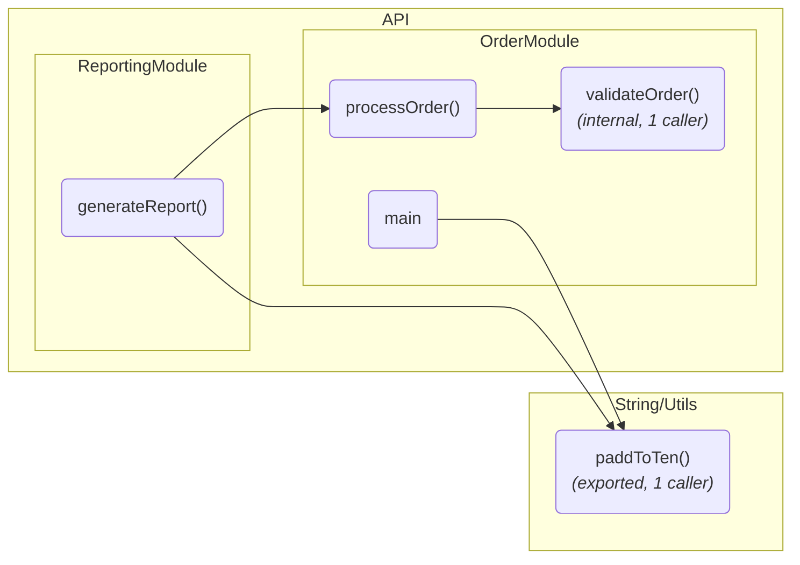

```mermaid
 graph LR
    subgraph String/Utils
      paddToTen("paddToTen()<br><i>(exported, 1 caller)</i>");
    end

    subgraph API
      subgraph OrderModule
        main("main") --> paddToTen;
        processOrder("processOrder()") --> validateOrder("validateOrder()<br><i>(internal, 1 caller)</i>");
      end
    
      subgraph ReportingModule
        generateReport("generateReport()") --> paddToTen;
        generateReport("generateReport()") --> processOrder;
      end
    end
```
