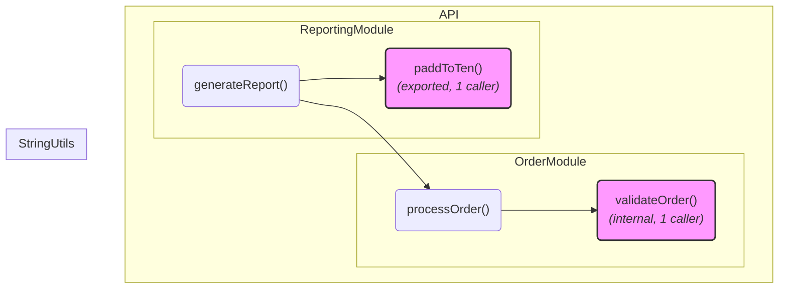

```mermaid
 graph TD
    subgraph API
         subgraph OrderModule
             processOrder("processOrder()") --> validateOrder("validateOrder()
             <i>(internal, 1 caller)</i>");
         end
    
         subgraph ReportingModule
             generateReport("generateReport()") --> paddToTen;
             generateReport("generateReport()") --> processOrder;
         end
    end
  
        subgraph StringUtils
            paddToTen("paddToTen()
            <i>(exported, 1 caller)</i>");
        end
   
        %% Style the inline candidates for emphasis
        style validateOrder fill:#f9f,stroke:#333,stroke-width:2px
        style paddToTen fill:#f9f,stroke:#333,stroke-width:2px
```
