# Sources
## Dependencies
### api/Exception.ts
### api/interfaces/IAbstractOperator.ts
### api/interfaces/IAbstractValue.ts
### api/interfaces/IArray.ts
### api/interfaces/IDebugSource.ts
### api/interfaces/IDictionary.ts
### api/interfaces/IMemoryTracker.ts
### api/interfaces/IReadOnlyArray.ts

export function enumIArrayValues 
### api/interfaces/IReadOnlyCallStack.ts
### api/interfaces/IReadOnlyDictionary.ts

export function enumIDictionaryValues (1)

export function convertIDictionaryToObject 

*  → enumIDictionaryValues
### api/interfaces/IState.ts
### api/interfaces/IValueTracker.ts
### api/parser.ts

* ← nullValue (./values/NullValue.js)

* ← assert (@sdk/assert.js)

function parseNumber 

*  → assert

function parseName 

*  → assert (3)

export function parse (3)

*  → assert

*  → parseString

*  → parseNumber

*  → parseName
### api/Result.ts
### api/run.ts

* ← toStringValue (@sdk/toValue.js)

export class RunError

export function run 

*  → toStringValue
### api/values/ArrayValue.ts
### api/values/BooleanValue.ts
### api/values/DictionaryValue.ts
### api/values/IntegerValue.ts
### api/values/MarkValue.ts
### api/values/NameValue.ts
### api/values/NullValue.ts
### api/values/OperatorValue.ts
### api/values/StringValue.ts
### api/values/Value.ts
### api/values/ValueType.ts
### core/MemoryTracker.ts

* ← SYSTEM_MEMORY_TYPE (@api/index.js)

* ← assert (@sdk/index.js)

* ← valuesOf (@sdk/index.js)

* → Symbol

export class MemoryTracker
  MemoryTracker::isAvailable

*  → assert (2)

*  → memorySizeToBytes
  MemoryTracker::allocate

*  → assert
  MemoryTracker::register

*  → assert (3)
  MemoryTracker::addStringRef

*  → stringSizer

*  → memorySizeToBytes
  MemoryTracker::releaseString

*  → assert

*  → stringSizer

*  → memorySizeToBytes
  MemoryTracker::snapshot

*  → stringSizer
  MemoryTracker::addValueRef

*  → valuesOf

*  → assert (3)
  MemoryTracker::releaseValue

*  → valuesOf

*  → assert

export function addMemorySize (4)

export function memorySizeToBytes (3)
### core/objects/AbstractValueContainer.ts

* ← nullValue (@api/index.js)

* ← assert (@sdk/index.js)

* ← addMemorySize (@core/MemoryTracker.js)

* ← ShareableObject (@core/objects/ShareableObject.js)

export class AbstractValueContainer
  AbstractValueContainer::toValue

*  → assert
  AbstractValueContainer::constructor

*  → assert (3)
  AbstractValueContainer::createInstance

*  → assert (2)
  AbstractValueContainer::getSize

*  → addMemorySize
  AbstractValueContainer::reserve

*  → assert
  AbstractValueContainer::swap

*  → assert
### core/objects/dictionaries/Dictionary.ts

* ← nullValue (@api/index.js)

* ← addMemorySize (@core/MemoryTracker.js)

* ← ShareableObject (@core/objects/ShareableObject.js)

* ← assert (@sdk/index.js)

export class Dictionary
  Dictionary::toValue

*  → assert
  Dictionary::constructor

*  → assert
  Dictionary::getSize

*  → addMemorySize
  Dictionary::def

*  → assert
### core/objects/dictionaries/Empty.ts

* ← nullValue (@api/index.js)

* ← assert (@sdk/index.js)

export class EmptyDictionary
  EmptyDictionary::def

*  → assert (2)
### core/objects/dictionaries/System.ts

* ← nullValue (@api/index.js)

* ← registry (@core/operators/index.js)

export class SystemDictionary
### core/objects/ShareableObject.ts

* ← assert (@sdk/index.js)

export class ShareableObject
  ShareableObject::release

*  → assert

function getShareableObject 

*  → assert
### core/objects/stacks/CallStack.ts

* ← nullValue (@api/index.js)

* ← SYSTEM_MEMORY_TYPE (@api/index.js)

* ← OPERATOR_STATE_UNKNOWN (@sdk/index.js)

* ← OPERATOR_STATE_FIRST_CALL (@sdk/index.js)

* ← OPERATOR_STATE_POP (@sdk/index.js)

* ← OPERATOR_STATE_CALL_BEFORE_POP (@sdk/index.js)

* ← assert (@sdk/index.js)

* ← addMemorySize (@core/MemoryTracker.js)

* ← ValueStack (@core/objects/stacks/ValueStack.js)

* ← Dictionary (@core/objects/dictionaries/Dictionary.js)

export class CallStack
  CallStack::create

*  → assert
  CallStack::getSize

*  → addMemorySize
  CallStack::getIncrementSize

*  → addMemorySize
  CallStack::topOperatorState

*  → assert
  CallStack::topOperatorState

*  → assert
### core/objects/stacks/DictionaryStack.ts

* ← SYSTEM_MEMORY_TYPE (@api/index.js)

* ← assert (@sdk/index.js)

* ← ValueStack (@core/objects/stacks/ValueStack.js)

* ← SystemDictionary (@core/objects/dictionaries/System.js)

* ← EmptyDictionary (@core/objects/dictionaries/Empty.js)

export class DictionaryStack
  DictionaryStack::create

*  → assert (2)
  DictionaryStack::getDictionaryValue

*  → assert
  DictionaryStack::setGlobal

*  → assert
  DictionaryStack::setUser

*  → assert
### core/objects/stacks/ValueStack.ts

* ← nullValue (@api/index.js)

* ← AbstractValueContainer (@core/objects/AbstractValueContainer.js)

export class ValueStack
### core/objects/ValueArray.ts

* ← nullValue (@api/index.js)

* ← assert (@sdk/index.js)

* ← AbstractValueContainer (@core/objects/AbstractValueContainer.js)

export class ValueArray
  ValueArray::toValue

*  → assert
### core/operators/array/aload.ts

* ← OPERATOR_STATE_FIRST_CALL (@sdk/index.js)

* ← OPERATOR_STATE_POP (@sdk/index.js)

* ← buildFunctionOperator (@core/operators/operators.js)

* ← assert (@sdk/assert.js)

* → buildFunctionOperator

function (anonymous arrow) 

*  → assert
### core/operators/array/closeArray.ts

* ← buildFunctionOperator (@core/operators/operators.js)

* ← closeToMark (@core/operators/openClose.js)

* → buildFunctionOperator

function (anonymous arrow) 

*  → closeToMark
### core/operators/array/openArray.ts

* ← buildFunctionOperator (@core/operators/operators.js)

* ← openWithMark (@core/operators/openClose.js)

* → buildFunctionOperator
### core/operators/boolean/and.ts

* ← falseValue (@api/index.js)

* ← trueValue (@api/index.js)

* ← buildFunctionOperator (@core/operators/operators.js)

* → buildFunctionOperator
### core/operators/boolean/or.ts

* ← falseValue (@api/index.js)

* ← trueValue (@api/index.js)

* ← buildFunctionOperator (@core/operators/operators.js)

* → buildFunctionOperator
### core/operators/boolean/xor.ts

* ← falseValue (@api/index.js)

* ← trueValue (@api/index.js)

* ← buildFunctionOperator (@core/operators/operators.js)

* → buildFunctionOperator
### core/operators/dictionary/closeDictionary.ts

* ← USER_MEMORY_TYPE (@api/index.js)

* ← findMarkPos (@sdk/index.js)

* ← valuesOf (@sdk/index.js)

* ← buildFunctionOperator (@core/operators/operators.js)

* ← pushOpenClosedValueWithDebugInfo (@core/operators/openClose.js)

* ← Dictionary (@core/objects/dictionaries/Dictionary.js)

* → buildFunctionOperator

function (anonymous arrow) 

*  → findMarkPos

*  → valuesOf

*  → pushOpenClosedValueWithDebugInfo
### core/operators/dictionary/openDictionary.ts

* ← buildFunctionOperator (@core/operators/operators.js)

* ← openWithMark (@core/operators/openClose.js)

* → buildFunctionOperator

function (anonymous arrow) 

*  → openWithMark
### core/operators/exceptions/dictStackUnderflow.ts

* ← buildFunctionOperator (@core/operators/operators.js)

* → buildFunctionOperator
### core/operators/exceptions/invalidAccess.ts

* ← buildFunctionOperator (@core/operators/operators.js)

* → buildFunctionOperator
### core/operators/exceptions/limitcheck.ts

* ← buildFunctionOperator (@core/operators/operators.js)

* → buildFunctionOperator
### core/operators/exceptions/rangeCheck.ts

* ← buildFunctionOperator (@core/operators/operators.js)

* → buildFunctionOperator
### core/operators/exceptions/stackUnderflow.ts

* ← buildFunctionOperator (@core/operators/operators.js)

* → buildFunctionOperator
### core/operators/exceptions/stop.ts

* ← buildFunctionOperator (@core/operators/operators.js)

* → buildFunctionOperator
### core/operators/exceptions/typeCheck.ts

* ← buildFunctionOperator (@core/operators/operators.js)

* → buildFunctionOperator
### core/operators/exceptions/undefined.ts

* ← buildFunctionOperator (@core/operators/operators.js)

* → buildFunctionOperator
### core/operators/exceptions/undefinedResult.ts

* ← buildFunctionOperator (@core/operators/operators.js)

* → buildFunctionOperator
### core/operators/exceptions/unmatchedMark.ts

* ← buildFunctionOperator (@core/operators/operators.js)

* → buildFunctionOperator
### core/operators/exceptions/vmOverflow.ts

* ← buildFunctionOperator (@core/operators/operators.js)

* → buildFunctionOperator
### core/operators/flow/closeBlock.ts

* ← OPERATOR_STATE_FIRST_CALL (@sdk/index.js)

* ← buildFunctionOperator (@core/operators/operators.js)

* ← closeToMark (@core/operators/openClose.js)

* → buildFunctionOperator

function (anonymous arrow) 

*  → closeToMark
### core/operators/flow/finally.ts

* ← nullValue (@api/index.js)

* ← OPERATOR_STATE_POP (@sdk/index.js)

* ← OPERATOR_STATE_FIRST_CALL (@sdk/index.js)

* ← OPERATOR_STATE_CALL_BEFORE_POP (@sdk/index.js)

* ← toStringValue (@sdk/index.js)

* ← assert (@sdk/index.js)

* ← buildFunctionOperator (@core/operators/operators.js)

* ← CallStack (@core/objects/stacks/CallStack.js)

* → buildFunctionOperator

function firstCall 

*  → assert

function callBeforePop 

*  → toStringValue

*  → assert (2)

function popping 

*  → assert (2)

function (anonymous arrow) 

*  → firstCall

*  → callBeforePop

*  → assert

*  → popping
### core/operators/flow/gc.ts

* ← assert (@sdk/index.js)

* ← OPERATOR_STATE_FIRST_CALL (@sdk/index.js)

* ← OPERATOR_STATE_POP (@sdk/index.js)

* ← buildFunctionOperator (@core/operators/operators.js)

* ← MemoryTracker (@core/MemoryTracker.js)

* → buildFunctionOperator

function (anonymous arrow) 

*  → assert
### core/operators/flow/if.ts

* ← buildFunctionOperator (@core/operators/operators.js)

* → buildFunctionOperator
### core/operators/flow/ifelse.ts

* ← buildFunctionOperator (@core/operators/operators.js)

* → buildFunctionOperator
### core/operators/flow/loop.ts

* ← OPERATOR_STATE_POP (@sdk/index.js)

* ← OPERATOR_STATE_FIRST_CALL (@sdk/index.js)

* ← OPERATOR_STATE_CALL_BEFORE_POP (@sdk/index.js)

* ← assert (@sdk/index.js)

* ← buildFunctionOperator (@core/operators/operators.js)

* → buildFunctionOperator

function (anonymous arrow) 

*  → assert
### core/operators/flow/openBlock.ts

* ← buildFunctionOperator (@core/operators/operators.js)

* ← openWithMark (@core/operators/openClose.js)

* → buildFunctionOperator

function (anonymous arrow) 

*  → openWithMark
### core/operators/flow/repeat.ts

* ← OPERATOR_STATE_POP (@sdk/index.js)

* ← OPERATOR_STATE_FIRST_CALL (@sdk/index.js)

* ← buildFunctionOperator (@core/operators/operators.js)

* → buildFunctionOperator

function (anonymous arrow) 

*  → firstCall

*  → repeat
### core/operators/flow/stopped.ts

* ← falseValue (@api/index.js)

* ← trueValue (@api/index.js)

* ← OPERATOR_STATE_POP (@sdk/index.js)

* ← OPERATOR_STATE_FIRST_CALL (@sdk/index.js)

* ← OPERATOR_STATE_CALL_BEFORE_POP (@sdk/index.js)

* ← assert (@sdk/index.js)

* ← buildFunctionOperator (@core/operators/operators.js)

* → buildFunctionOperator

function (anonymous arrow) 

*  → assert
### core/operators/integer/abs.ts

* ← toIntegerValue (@sdk/index.js)

* ← buildFunctionOperator (@core/operators/operators.js)

* → buildFunctionOperator

function (anonymous arrow) 

*  → toIntegerValue
### core/operators/integer/add.ts

* ← toIntegerValue (@sdk/index.js)

* ← buildFunctionOperator (@core/operators/operators.js)

* → buildFunctionOperator

function (anonymous arrow) 

*  → toIntegerValue
### core/operators/integer/div.ts

* ← toIntegerValue (@sdk/index.js)

* ← buildFunctionOperator (@core/operators/operators.js)

* → buildFunctionOperator

function (anonymous arrow) 

*  → toIntegerValue (2)
### core/operators/integer/gt.ts

* ← falseValue (@api/index.js)

* ← trueValue (@api/index.js)

* ← buildFunctionOperator (@core/operators/operators.js)

* → buildFunctionOperator
### core/operators/integer/gte.ts

* ← falseValue (@api/index.js)

* ← trueValue (@api/index.js)

* ← buildFunctionOperator (@core/operators/operators.js)

* → buildFunctionOperator
### core/operators/integer/lt.ts

* ← trueValue (@api/index.js)

* ← falseValue (@api/index.js)

* ← buildFunctionOperator (@core/operators/operators.js)

* → buildFunctionOperator
### core/operators/integer/lte.ts

* ← trueValue (@api/index.js)

* ← falseValue (@api/index.js)

* ← buildFunctionOperator (@core/operators/operators.js)

* → buildFunctionOperator
### core/operators/integer/mul.ts

* ← toIntegerValue (@sdk/index.js)

* ← buildFunctionOperator (@core/operators/operators.js)

* → buildFunctionOperator

function (anonymous arrow) 

*  → toIntegerValue
### core/operators/integer/sub.ts

* ← toIntegerValue (@sdk/index.js)

* ← buildFunctionOperator (@core/operators/operators.js)

* → buildFunctionOperator

function (anonymous arrow) 

*  → toIntegerValue
### core/operators/openClose.ts

* ← USER_MEMORY_TYPE (@api/index.js)

* ← markValue (@api/index.js)

* ← assert (@sdk/index.js)

* ← findMarkPos (@sdk/index.js)

* ← OPERATOR_STATE_FIRST_CALL (@sdk/index.js)

* ← OPERATOR_STATE_POP (@sdk/index.js)

* ← toIntegerValue (@sdk/index.js)

* ← ValueArray (@core/objects/ValueArray.js)

export function openWithMark (2)

export function pushOpenClosedValueWithDebugInfo (2)

export function closeToMark (2)

*  → findMarkPos

*  → toIntegerValue

*  → assert (4)

*  → pushOpenClosedValueWithDebugInfo
### core/operators/operators.ts

* ← assert (@sdk/index.js)

* ← OperatorType (@sdk/index.js)

export function buildFunctionOperator (68)

*  → assert

export function buildConstantOperator (4)
### core/operators/stacks/call/countexecstack.ts

* ← assert (@sdk/index.js)

* ← toIntegerValue (@sdk/index.js)

* ← buildFunctionOperator (@core/operators/operators.js)

* → buildFunctionOperator

function (anonymous arrow) 

*  → toIntegerValue

*  → assert
### core/operators/stacks/dictionary/begin.ts

* ← buildFunctionOperator (@core/operators/operators.js)

* → buildFunctionOperator
### core/operators/stacks/dictionary/bind.ts

* ← assert (@sdk/index.js)

* ← isArrayValue (@sdk/index.js)

* ← OPERATOR_STATE_POP (@sdk/index.js)

* ← ValueArray (@core/objects/ValueArray.js)

* ← buildFunctionOperator (@core/operators/operators.js)

* ← pop (@core/operators/stacks/operand/pop.js)

* → buildFunctionOperator

function bindValue 

*  → bindName

*  → assert

*  → bindArray

function (anonymous arrow) 

*  → assert (2)

*  → isArrayValue

*  → bindValue
### core/operators/stacks/dictionary/countdictstack.ts

* ← assert (@sdk/index.js)

* ← toIntegerValue (@sdk/index.js)

* ← buildFunctionOperator (@core/operators/operators.js)

* → buildFunctionOperator

function (anonymous arrow) 

*  → toIntegerValue

*  → assert
### core/operators/stacks/dictionary/currentdict.ts

* ← buildFunctionOperator (@core/operators/operators.js)

* → buildFunctionOperator
### core/operators/stacks/dictionary/def.ts

* ← buildFunctionOperator (@core/operators/operators.js)

* → buildFunctionOperator
### core/operators/stacks/dictionary/end.ts

* ← buildFunctionOperator (@core/operators/operators.js)

* → buildFunctionOperator
### core/operators/stacks/dictionary/globaldict.ts

* ← buildFunctionOperator (@core/operators/operators.js)

* → buildFunctionOperator
### core/operators/stacks/dictionary/hostdict.ts

* ← buildFunctionOperator (@core/operators/operators.js)

* → buildFunctionOperator
### core/operators/stacks/dictionary/systemdict.ts

* ← buildFunctionOperator (@core/operators/operators.js)

* → buildFunctionOperator
### core/operators/stacks/dictionary/userdict.ts

* ← buildFunctionOperator (@core/operators/operators.js)

* → buildFunctionOperator
### core/operators/stacks/operand/clear.ts

* ← buildFunctionOperator (@core/operators/operators.js)

* → buildFunctionOperator
### core/operators/stacks/operand/cleartomark.ts

* ← findMarkPos (@sdk/index.js)

* ← buildFunctionOperator (@core/operators/operators.js)

* → buildFunctionOperator

function (anonymous arrow) 

*  → findMarkPos
### core/operators/stacks/operand/count.ts

* ← assert (@sdk/index.js)

* ← toIntegerValue (@sdk/index.js)

* ← buildFunctionOperator (@core/operators/operators.js)

* → buildFunctionOperator

function (anonymous arrow) 

*  → toIntegerValue

*  → assert
### core/operators/stacks/operand/counttomark.ts

* ← assert (@sdk/index.js)

* ← findMarkPos (@sdk/index.js)

* ← toIntegerValue (@sdk/index.js)

* ← buildFunctionOperator (@core/operators/operators.js)

* → buildFunctionOperator

function (anonymous arrow) 

*  → findMarkPos

*  → toIntegerValue

*  → assert
### core/operators/stacks/operand/dup.ts

* ← buildFunctionOperator (@core/operators/operators.js)

* → buildFunctionOperator
### core/operators/stacks/operand/exch.ts

* ← buildFunctionOperator (@core/operators/operators.js)

* → buildFunctionOperator
### core/operators/stacks/operand/indexOp.ts

* ← buildFunctionOperator (@core/operators/operators.js)

* → buildFunctionOperator
### core/operators/stacks/operand/pop.ts

* ← buildFunctionOperator (@core/operators/operators.js)

* → buildFunctionOperator
### core/operators/stacks/operand/roll.ts

* ← buildFunctionOperator (@core/operators/operators.js)

* ← assert (@sdk/index.js)

* ← toIntegerValue (@sdk/index.js)

* ← OPERATOR_STATE_FIRST_CALL (@sdk/index.js)

* ← OPERATOR_STATE_POP (@sdk/index.js)

* → buildFunctionOperator

function initialize 

*  → toIntegerValue (2)

*  → assert (2)

function roll 

*  → assert (5)

*  → toIntegerValue

function (anonymous arrow) 

*  → initialize

*  → roll
### core/operators/value/convert/cvi.ts

* ← toIntegerValue (@sdk/index.js)

* ← buildFunctionOperator (@core/operators/operators.js)

* → buildFunctionOperator

function (anonymous arrow) 

*  → toIntegerValue
### core/operators/value/convert/cvlit.ts

* ← buildFunctionOperator (@core/operators/operators.js)

* → buildFunctionOperator
### core/operators/value/convert/cvn.ts

* ← assert (@sdk/index.js)

* ← toNameValue (@sdk/index.js)

* ← buildFunctionOperator (@core/operators/operators.js)

* ← MemoryTracker (@core/MemoryTracker.js)

* → buildFunctionOperator

function (anonymous arrow) 

*  → assert

*  → toNameValue
### core/operators/value/eq.ts

* ← trueValue (@api/index.js)

* ← falseValue (@api/index.js)

* ← valuesOf (@sdk/index.js)

* ← buildFunctionOperator (@core/operators/operators.js)

* → buildFunctionOperator

function (anonymous arrow) 

*  → valuesOf
### core/operators/value/false.ts

* ← falseValue (@api/index.js)

* ← buildConstantOperator (@core/operators/operators.js)

* → buildConstantOperator
### core/operators/value/get.ts

* ← assert (@sdk/index.js)

* ← checkPos (@sdk/index.js)

* ← toStringValue (@sdk/index.js)

* ← buildFunctionOperator (@core/operators/operators.js)

* ← MemoryTracker (@core/MemoryTracker.js)

* → buildFunctionOperator

function (anonymous arrow) 

*  → assert

*  → checkPos

*  → toStringValue

function (anonymous arrow) 

*  → checkPos

function (anonymous arrow) 

*  → implementation
### core/operators/value/length.ts

* ← assert (@sdk/index.js)

* ← toIntegerValue (@sdk/index.js)

* ← buildFunctionOperator (@core/operators/operators.js)

* → buildFunctionOperator

function (anonymous arrow) 

*  → toIntegerValue

*  → implementation

*  → assert
### core/operators/value/mark.ts

* ← markValue (@api/index.js)

* ← buildConstantOperator (../operators.js)

* → buildConstantOperator
### core/operators/value/neq.ts

* ← trueValue (@api/index.js)

* ← falseValue (@api/index.js)

* ← valuesOf (@sdk/index.js)

* ← buildFunctionOperator (@core/operators/operators.js)

* → buildFunctionOperator

function (anonymous arrow) 

*  → valuesOf
### core/operators/value/put.ts

* ← assert (@sdk/index.js)

* ← checkPos (@sdk/index.js)

* ← toStringValue (@sdk/index.js)

* ← buildFunctionOperator (@core/operators/operators.js)

* ← MemoryTracker (@core/MemoryTracker.js)

* → buildFunctionOperator

function (anonymous arrow) 

*  → assert

*  → checkPos

*  → toStringValue

function (anonymous arrow) 

*  → checkPos

function (anonymous arrow) 

*  → implementation
### core/operators/value/true.ts

* ← trueValue (@api/index.js)

* ← buildConstantOperator (@core/operators/operators.js)

* → buildConstantOperator
### core/operators/value/type.ts

* ← toNameValue (@sdk/index.js)

* ← buildFunctionOperator (@core/operators/operators.js)

* → buildFunctionOperator

function (anonymous arrow) 

*  → toNameValue
### core/operators/value/version.ts

* ← toStringValue (@sdk/index.js)

* ← buildConstantOperator (../operators.js)

* → buildConstantOperator

* → toStringValue
### core/operators/value/wcheck.ts

* ← trueValue (@api/index.js)

* ← falseValue (@api/index.js)

* ← buildFunctionOperator (@core/operators/operators.js)

* → buildFunctionOperator
### core/operators/value/xcheck.ts

* ← trueValue (@api/index.js)

* ← falseValue (@api/index.js)

* ← buildFunctionOperator (@core/operators/operators.js)

* → buildFunctionOperator
### core/state/block.ts

* ← OPERATOR_STATE_FIRST_CALL (@sdk/index.js)

* ← OPERATOR_STATE_UNKNOWN (@sdk/index.js)

export function blockCycle (1)
### core/state/call.ts

* ← OPERATOR_STATE_FIRST_CALL (@sdk/index.js)

export function callCycle (1)
### core/state/operator.ts

* ← SYSTEM_MEMORY_TYPE (@api/index.js)

* ← OPERATOR_STATE_UNKNOWN (@sdk/index.js)

* ← OPERATOR_STATE_FIRST_CALL (@sdk/index.js)

* ← OPERATOR_STATE_POP (@sdk/index.js)

* ← OperatorType (@sdk/index.js)

* ← assert (@sdk/index.js)

* ← MemoryTracker (@core/MemoryTracker.js)

export function operatorPop (2)

function handleFunctionOperatorTypeCheck 

*  → assert (2)

function handleFunctionOperator 

*  → assert

*  → handleFunctionOperatorTypeCheck

export function operatorCycle (1)

*  → operatorPop

*  → handleFunctionOperator
### core/state/parse.ts

* ← parse (@api/index.js)

* ← VALUE_TYPE (@api/index.js)

* ← OPERATOR_STATE_FIRST_CALL (@sdk/index.js)

* ← OPERATOR_STATE_UNKNOWN (@sdk/index.js)

* ← valuesOf (@sdk/index.js)

function getToken 

*  → parse (2)

function enqueueToken 

*  → valuesOf

export function parseCycle (1)

*  → getToken

*  → enqueueToken
### core/state/State.ts

* ← SYSTEM_MEMORY_TYPE (@api/index.js)

* ← assert (@sdk/index.js)

* ← MemoryTracker (@core/MemoryTracker.js)

* ← DictionaryStack (@core/objects/stacks/DictionaryStack.js)

* ← Dictionary (@core/objects/dictionaries/Dictionary.js)

* ← ValueStack (@core/objects/stacks/ValueStack.js)

* ← CallStack (@core/objects/stacks/CallStack.js)

* ← operatorPop (./operator.js)

* ← operatorCycle (./operator.js)

* ← callCycle (./call.js)

* ← blockCycle (./block.js)

* ← parseCycle (./parse.js)

* ← SystemDictionary (@core/objects/dictionaries/System.js)

export class State
  State::_checkIfDestroyed

*  → assert
  State::destroy

*  → assert
  State::raiseException

*  → assert (4)
  State::cycle

*  → operatorPop

*  → operatorCycle

*  → callCycle

*  → blockCycle

*  → parseCycle

*  → assert
### sdk/assert.ts

class AssertionFailed

export function assert (83)
### sdk/checkPos.ts

export function checkPos (4)
### sdk/checks/isObject.ts

export function isObject (1)
### sdk/checks/isValue.ts

* ← isObject (@sdk/checks/isObject.js)

function is 

*  → isObject

*  → hasInvalidFlag

*  → checkFlags

*  → check

export function isIntegerValue 

*  → is

*  → isInteger

export function isStringValue 

*  → is

export function isNameValue 

*  → is

export function isOperatorValue 

*  → is

function isPositiveInteger 

*  → isInteger

export function isArrayValue (1)

*  → is

*  → isPositiveInteger

*  → isFunction (2)

export function isDictionaryValue 

*  → is

*  → isFunction (2)
### sdk/findMarkPos.ts

export function findMarkPos (4)
### sdk/interfaces/ICallStack.ts
### sdk/interfaces/IDictionaryStack.ts
### sdk/interfaces/IInternalState.ts
### sdk/interfaces/IOperandStack.ts
### sdk/interfaces/IOperator.ts
### sdk/interfaces/IStack.ts
### sdk/toString.ts

* ← parse (@api/index.js)

* ← OPERATOR_STATE_CALL_BEFORE_POP (@sdk/interfaces/ICallStack.js)

* ← OPERATOR_STATE_FIRST_CALL (@sdk/interfaces/ICallStack.js)

* ← OPERATOR_STATE_POP (@sdk/interfaces/ICallStack.js)

* ← OPERATOR_STATE_UNKNOWN (@sdk/interfaces/ICallStack.js)

function fitToMaxWidth 

*  → minimizeAt

*  → centerValue

function decorate 

*  → convertPosToLineAndCol

*  → fitToMaxWidth

function (anonymous arrow) 

*  → decorate

function (anonymous arrow) 

*  → decorate

function (anonymous arrow) 

*  → decorate

function (anonymous arrow) 

*  → parse

*  → decorate

function (anonymous arrow) 

*  → decorate

function (anonymous arrow) 

*  → decorate

function (anonymous arrow) 

*  → decorate

function (anonymous arrow) 

*  → decorate

function (anonymous arrow) 

*  → decorate

export function toString (1)

export function callStackToString 

*  → toString
### sdk/toValue.ts

export function toIntegerValue (16)

export function toStringValue (5)

export function toNameValue (2)
### sdk/valuesOf.ts

export function valuesOf (6)

*  → getValueOf
## Grap

```mermaid
graph LR
  subgraph api/Exception.ts
  end
  subgraph api/interfaces/IAbstractOperator.ts
  end
  subgraph api/interfaces/IAbstractValue.ts
  end
  subgraph api/interfaces/IArray.ts
  end
  subgraph api/interfaces/IDebugSource.ts
  end
  subgraph api/interfaces/IDictionary.ts
  end
  subgraph api/interfaces/IMemoryTracker.ts
  end
  subgraph api/interfaces/IReadOnlyArray.ts
  end
  subgraph api/interfaces/IReadOnlyCallStack.ts
  end
  subgraph api/interfaces/IReadOnlyDictionary.ts
  end
  subgraph api/interfaces/IState.ts
  end
  subgraph api/interfaces/IValueTracker.ts
  end
  subgraph api/parser.ts
  end
  subgraph api/Result.ts
  end
  subgraph api/run.ts
  end
  subgraph api/values/ArrayValue.ts
  end
  subgraph api/values/BooleanValue.ts
  end
  subgraph api/values/DictionaryValue.ts
  end
  subgraph api/values/IntegerValue.ts
  end
  subgraph api/values/MarkValue.ts
  end
  subgraph api/values/NameValue.ts
  end
  subgraph api/values/NullValue.ts
  end
  subgraph api/values/OperatorValue.ts
  end
  subgraph api/values/StringValue.ts
  end
  subgraph api/values/Value.ts
  end
  subgraph api/values/ValueType.ts
  end
  subgraph core/MemoryTracker.ts
    main_36("main") --> Symbol;
  end
  subgraph core/objects/AbstractValueContainer.ts
  end
  subgraph core/objects/dictionaries/Dictionary.ts
  end
  subgraph core/objects/dictionaries/Empty.ts
  end
  subgraph core/objects/dictionaries/System.ts
  end
  subgraph core/objects/ShareableObject.ts
  end
  subgraph core/objects/stacks/CallStack.ts
  end
  subgraph core/objects/stacks/DictionaryStack.ts
  end
  subgraph core/objects/stacks/ValueStack.ts
  end
  subgraph core/objects/ValueArray.ts
  end
  subgraph core/operators/array/aload.ts
    main_50("main") --> buildFunctionOperator;
  end
  subgraph core/operators/array/closeArray.ts
    main_52("main") --> buildFunctionOperator;
  end
  subgraph core/operators/array/openArray.ts
    main_54("main") --> buildFunctionOperator;
  end
  subgraph core/operators/boolean/and.ts
    main_55("main") --> buildFunctionOperator;
  end
  subgraph core/operators/boolean/or.ts
    main_57("main") --> buildFunctionOperator;
  end
  subgraph core/operators/boolean/xor.ts
    main_59("main") --> buildFunctionOperator;
  end
  subgraph core/operators/dictionary/closeDictionary.ts
    main_61("main") --> buildFunctionOperator;
  end
  subgraph core/operators/dictionary/openDictionary.ts
    main_63("main") --> buildFunctionOperator;
  end
  subgraph core/operators/exceptions/dictStackUnderflow.ts
    main_65("main") --> buildFunctionOperator;
  end
  subgraph core/operators/exceptions/invalidAccess.ts
    main_67("main") --> buildFunctionOperator;
  end
  subgraph core/operators/exceptions/limitcheck.ts
    main_69("main") --> buildFunctionOperator;
  end
  subgraph core/operators/exceptions/rangeCheck.ts
    main_71("main") --> buildFunctionOperator;
  end
  subgraph core/operators/exceptions/stackUnderflow.ts
    main_73("main") --> buildFunctionOperator;
  end
  subgraph core/operators/exceptions/stop.ts
    main_75("main") --> buildFunctionOperator;
  end
  subgraph core/operators/exceptions/typeCheck.ts
    main_77("main") --> buildFunctionOperator;
  end
  subgraph core/operators/exceptions/undefined.ts
    main_79("main") --> buildFunctionOperator;
  end
  subgraph core/operators/exceptions/undefinedResult.ts
    main_81("main") --> buildFunctionOperator;
  end
  subgraph core/operators/exceptions/unmatchedMark.ts
    main_83("main") --> buildFunctionOperator;
  end
  subgraph core/operators/exceptions/vmOverflow.ts
    main_85("main") --> buildFunctionOperator;
  end
  subgraph core/operators/flow/closeBlock.ts
    main_87("main") --> buildFunctionOperator;
  end
  subgraph core/operators/flow/finally.ts
    main_89("main") --> buildFunctionOperator;
  end
  subgraph core/operators/flow/gc.ts
    main_94("main") --> buildFunctionOperator;
  end
  subgraph core/operators/flow/if.ts
    main_96("main") --> buildFunctionOperator;
  end
  subgraph core/operators/flow/ifelse.ts
    main_98("main") --> buildFunctionOperator;
  end
  subgraph core/operators/flow/loop.ts
    main_100("main") --> buildFunctionOperator;
  end
  subgraph core/operators/flow/openBlock.ts
    main_102("main") --> buildFunctionOperator;
  end
  subgraph core/operators/flow/repeat.ts
    main_104("main") --> buildFunctionOperator;
  end
  subgraph core/operators/flow/stopped.ts
    main_108("main") --> buildFunctionOperator;
  end
  subgraph core/operators/integer/abs.ts
    main_110("main") --> buildFunctionOperator;
  end
  subgraph core/operators/integer/add.ts
    main_112("main") --> buildFunctionOperator;
  end
  subgraph core/operators/integer/div.ts
    main_114("main") --> buildFunctionOperator;
  end
  subgraph core/operators/integer/gt.ts
    main_116("main") --> buildFunctionOperator;
  end
  subgraph core/operators/integer/gte.ts
    main_118("main") --> buildFunctionOperator;
  end
  subgraph core/operators/integer/lt.ts
    main_120("main") --> buildFunctionOperator;
  end
  subgraph core/operators/integer/lte.ts
    main_122("main") --> buildFunctionOperator;
  end
  subgraph core/operators/integer/mul.ts
    main_124("main") --> buildFunctionOperator;
  end
  subgraph core/operators/integer/sub.ts
    main_126("main") --> buildFunctionOperator;
  end
  subgraph core/operators/openClose.ts
  end
  subgraph core/operators/operators.ts
  end
  subgraph core/operators/stacks/call/countexecstack.ts
    main_135("main") --> buildFunctionOperator;
  end
  subgraph core/operators/stacks/dictionary/begin.ts
    main_137("main") --> buildFunctionOperator;
  end
  subgraph core/operators/stacks/dictionary/bind.ts
    main_139("main") --> buildFunctionOperator;
  end
  subgraph core/operators/stacks/dictionary/countdictstack.ts
    main_144("main") --> buildFunctionOperator;
  end
  subgraph core/operators/stacks/dictionary/currentdict.ts
    main_146("main") --> buildFunctionOperator;
  end
  subgraph core/operators/stacks/dictionary/def.ts
    main_148("main") --> buildFunctionOperator;
  end
  subgraph core/operators/stacks/dictionary/end.ts
    main_150("main") --> buildFunctionOperator;
  end
  subgraph core/operators/stacks/dictionary/globaldict.ts
    main_152("main") --> buildFunctionOperator;
  end
  subgraph core/operators/stacks/dictionary/hostdict.ts
    main_154("main") --> buildFunctionOperator;
  end
  subgraph core/operators/stacks/dictionary/systemdict.ts
    main_156("main") --> buildFunctionOperator;
  end
  subgraph core/operators/stacks/dictionary/userdict.ts
    main_158("main") --> buildFunctionOperator;
  end
  subgraph core/operators/stacks/operand/clear.ts
    main_160("main") --> buildFunctionOperator;
  end
  subgraph core/operators/stacks/operand/cleartomark.ts
    main_162("main") --> buildFunctionOperator;
  end
  subgraph core/operators/stacks/operand/count.ts
    main_164("main") --> buildFunctionOperator;
  end
  subgraph core/operators/stacks/operand/counttomark.ts
    main_166("main") --> buildFunctionOperator;
  end
  subgraph core/operators/stacks/operand/dup.ts
    main_168("main") --> buildFunctionOperator;
  end
  subgraph core/operators/stacks/operand/exch.ts
    main_170("main") --> buildFunctionOperator;
  end
  subgraph core/operators/stacks/operand/indexOp.ts
    main_172("main") --> buildFunctionOperator;
  end
  subgraph core/operators/stacks/operand/pop.ts
    main_174("main") --> buildFunctionOperator;
  end
  subgraph core/operators/stacks/operand/roll.ts
    main_176("main") --> buildFunctionOperator;
  end
  subgraph core/operators/value/convert/cvi.ts
    main_180("main") --> buildFunctionOperator;
  end
  subgraph core/operators/value/convert/cvlit.ts
    main_182("main") --> buildFunctionOperator;
  end
  subgraph core/operators/value/convert/cvn.ts
    main_184("main") --> buildFunctionOperator;
  end
  subgraph core/operators/value/eq.ts
    main_186("main") --> buildFunctionOperator;
  end
  subgraph core/operators/value/false.ts
    main_188("main") --> buildConstantOperator;
  end
  subgraph core/operators/value/get.ts
    main_189("main") --> buildFunctionOperator;
  end
  subgraph core/operators/value/length.ts
    main_194("main") --> buildFunctionOperator;
  end
  subgraph core/operators/value/mark.ts
    main_199("main") --> buildConstantOperator;
  end
  subgraph core/operators/value/neq.ts
    main_200("main") --> buildFunctionOperator;
  end
  subgraph core/operators/value/put.ts
    main_202("main") --> buildFunctionOperator;
  end
  subgraph core/operators/value/true.ts
    main_207("main") --> buildConstantOperator;
  end
  subgraph core/operators/value/type.ts
    main_208("main") --> buildFunctionOperator;
  end
  subgraph core/operators/value/version.ts
    main_210("main") --> buildConstantOperator;
    main_210("main") --> toStringValue;
  end
  subgraph core/operators/value/wcheck.ts
    main_211("main") --> buildFunctionOperator;
  end
  subgraph core/operators/value/xcheck.ts
    main_213("main") --> buildFunctionOperator;
  end
  subgraph core/state/block.ts
  end
  subgraph core/state/call.ts
  end
  subgraph core/state/operator.ts
  end
  subgraph core/state/parse.ts
  end
  subgraph core/state/State.ts
  end
  subgraph sdk/assert.ts
  end
  subgraph sdk/checkPos.ts
  end
  subgraph sdk/checks/isObject.ts
  end
  subgraph sdk/checks/isValue.ts
  end
  subgraph sdk/findMarkPos.ts
  end
  subgraph sdk/interfaces/ICallStack.ts
  end
  subgraph sdk/interfaces/IDictionaryStack.ts
  end
  subgraph sdk/interfaces/IInternalState.ts
  end
  subgraph sdk/interfaces/IOperandStack.ts
  end
  subgraph sdk/interfaces/IOperator.ts
  end
  subgraph sdk/interfaces/IStack.ts
  end
  subgraph sdk/toString.ts
  end
  subgraph sdk/toValue.ts
  end
  subgraph sdk/valuesOf.ts
  end
```
