# Sources analysis

## Sources

### api/Exception.ts

```mermaid
graph
  subgraph "api/Exception.ts"
    getExceptionMessage("📦&nbsp;getExceptionMessage");
  end
```

### api/interfaces/IReadOnlyArray.ts

```mermaid
graph
  subgraph "api/interfaces/IReadOnlyArray.ts"
    enumIArrayValues("📦&nbsp;enumIArrayValues");
  end
```

### api/interfaces/IReadOnlyDictionary.ts


### api/parser.ts

```mermaid
graph
  subgraph "sdk/assert.ts"
    assert("📦&nbsp;assert");
  end
  subgraph "api/parser.ts"
    parseNumber --> assert;
    parseName --> assert;
    parse("📦&nbsp;parse");
    parse --> assert;
    parse --> parseString;
    parse --> parseNumber;
    parse --> parseName;
  end
```

### api/run.ts

```mermaid
graph
  subgraph "sdk/toValue.ts"
    toStringValue("📦&nbsp;toStringValue");
  end
  subgraph "api/run.ts"
    run("📦&nbsp;run");
    run --> toStringValue;
    RunError("📦&nbsp;_class_&nbsp;RunError")
    RunError --> Error;
  end
```

### core/MemoryTracker.ts

```mermaid
graph
  subgraph "sdk/assert.ts"
    assert("📦&nbsp;assert");
  end
  subgraph "sdk/valuesOf.ts"
    valuesOf("📦&nbsp;valuesOf");
  end
  subgraph "core/MemoryTracker.ts"
    addMemorySize("📦&nbsp;addMemorySize");
    memorySizeToBytes("📦&nbsp;memorySizeToBytes");
    MemoryTracker("📦&nbsp;_class_&nbsp;MemoryTracker")
    MemoryTracker --- isAvailable("MemoryTracker::isAvailable");
    isAvailable --> assert;
    isAvailable --> memorySizeToBytes;
    MemoryTracker --- allocate("MemoryTracker::allocate");
    allocate --> assert;
    MemoryTracker --- register("MemoryTracker::register");
    register --> assert;
    MemoryTracker --- addStringRef("MemoryTracker::addStringRef");
    addStringRef --> stringSizer;
    addStringRef --> memorySizeToBytes;
    MemoryTracker --- releaseString("MemoryTracker::releaseString");
    releaseString --> assert;
    releaseString --> stringSizer;
    releaseString --> memorySizeToBytes;
    MemoryTracker --- snapshot("MemoryTracker::snapshot");
    snapshot --> stringSizer;
    MemoryTracker --- addValueRef("MemoryTracker::addValueRef");
    addValueRef --> valuesOf;
    addValueRef --> assert;
    MemoryTracker --- releaseValue("MemoryTracker::releaseValue");
    releaseValue --> valuesOf;
    releaseValue --> assert;
  end
```

* ⚠️ `memorySizeToBytes` is exported but not used _(and not part of API or SDK)_
### core/objects/AbstractValueContainer.ts

```mermaid
graph
  subgraph "core/objects/ShareableObject.ts"
    ShareableObject("📦&nbsp;_class_&nbsp;ShareableObject");
  end
  subgraph "sdk/assert.ts"
    assert("📦&nbsp;assert");
  end
  subgraph "core/MemoryTracker.ts"
    addMemorySize("📦&nbsp;addMemorySize");
  end
  subgraph "core/objects/AbstractValueContainer.ts"
    AbstractValueContainer("📦&nbsp;_class_&nbsp;AbstractValueContainer")
    AbstractValueContainer --> ShareableObject;
    AbstractValueContainer --- toValue("AbstractValueContainer::toValue");
    toValue --> assert;
    AbstractValueContainer --- ctor("AbstractValueContainer::constructor");
    ctor --> assert;
    AbstractValueContainer --- createInstance("AbstractValueContainer::createInstance");
    createInstance --> assert;
    AbstractValueContainer --- getSize("AbstractValueContainer::getSize");
    getSize --> addMemorySize;
    AbstractValueContainer --- reserve("AbstractValueContainer::reserve");
    reserve --> assert;
    AbstractValueContainer --- swap("AbstractValueContainer::swap");
    swap --> assert;
  end
```

### core/objects/dictionaries/Dictionary.ts

```mermaid
graph
  subgraph "core/objects/ShareableObject.ts"
    ShareableObject("📦&nbsp;_class_&nbsp;ShareableObject");
  end
  subgraph "sdk/assert.ts"
    assert("📦&nbsp;assert");
  end
  subgraph "core/MemoryTracker.ts"
    addMemorySize("📦&nbsp;addMemorySize");
  end
  subgraph "core/objects/dictionaries/Dictionary.ts"
    Dictionary("📦&nbsp;_class_&nbsp;Dictionary")
    Dictionary --> ShareableObject;
    Dictionary --- toValue("Dictionary::toValue");
    toValue --> assert;
    Dictionary --- ctor("Dictionary::constructor");
    ctor --> assert;
    Dictionary --- getSize("Dictionary::getSize");
    getSize --> addMemorySize;
    Dictionary --- def("Dictionary::def");
    def --> assert;
  end
```

### core/objects/dictionaries/Empty.ts

```mermaid
graph
  subgraph "sdk/assert.ts"
    assert("📦&nbsp;assert");
  end
  subgraph "core/objects/dictionaries/Empty.ts"
    EmptyDictionary("📦&nbsp;_class_&nbsp;EmptyDictionary")
    EmptyDictionary --- def("EmptyDictionary::def");
    def --> assert;
  end
```

### core/objects/dictionaries/System.ts

```mermaid
graph
  subgraph "core/objects/dictionaries/System.ts"
    SystemDictionary("📦&nbsp;_class_&nbsp;SystemDictionary")
  end
```

### core/objects/ShareableObject.ts

```mermaid
graph
  subgraph "sdk/assert.ts"
    assert("📦&nbsp;assert");
  end
  subgraph "core/objects/ShareableObject.ts"
    getShareableObject --> assert;
    ShareableObject("📦&nbsp;_class_&nbsp;ShareableObject")
    ShareableObject --- release("ShareableObject::release");
    release --> assert;
  end
```

### core/objects/stacks/CallStack.ts

```mermaid
graph
  subgraph "core/objects/stacks/ValueStack.ts"
    ValueStack("📦&nbsp;_class_&nbsp;ValueStack");
  end
  subgraph "sdk/assert.ts"
    assert("📦&nbsp;assert");
  end
  subgraph "core/MemoryTracker.ts"
    addMemorySize("📦&nbsp;addMemorySize");
  end
  subgraph "core/objects/stacks/CallStack.ts"
    CallStack("📦&nbsp;_class_&nbsp;CallStack")
    CallStack --> ValueStack;
    CallStack --- create("CallStack::create");
    create --> assert;
    CallStack --- getSize("CallStack::getSize");
    getSize --> addMemorySize;
    CallStack --- getIncrementSize("CallStack::getIncrementSize");
    getIncrementSize --> addMemorySize;
    CallStack --- topOperatorState("CallStack::topOperatorState");
    topOperatorState --> assert;
    CallStack --- topOperatorState("CallStack::topOperatorState");
    topOperatorState --> assert;
  end
```

### core/objects/stacks/DictionaryStack.ts

```mermaid
graph
  subgraph "core/objects/stacks/ValueStack.ts"
    ValueStack("📦&nbsp;_class_&nbsp;ValueStack");
  end
  subgraph "sdk/assert.ts"
    assert("📦&nbsp;assert");
  end
  subgraph "core/objects/stacks/DictionaryStack.ts"
    DictionaryStack("📦&nbsp;_class_&nbsp;DictionaryStack")
    DictionaryStack --> ValueStack;
    DictionaryStack --- create("DictionaryStack::create");
    create --> assert;
    DictionaryStack --- getDictionaryValue("DictionaryStack::getDictionaryValue");
    getDictionaryValue --> assert;
    DictionaryStack --- setGlobal("DictionaryStack::setGlobal");
    setGlobal --> assert;
    DictionaryStack --- setUser("DictionaryStack::setUser");
    setUser --> assert;
  end
```

### core/objects/stacks/ValueStack.ts

```mermaid
graph
  subgraph "core/objects/AbstractValueContainer.ts"
    AbstractValueContainer("📦&nbsp;_class_&nbsp;AbstractValueContainer");
  end
  subgraph "core/objects/stacks/ValueStack.ts"
    ValueStack("📦&nbsp;_class_&nbsp;ValueStack")
    ValueStack --> AbstractValueContainer;
  end
```

### core/objects/ValueArray.ts

```mermaid
graph
  subgraph "core/objects/AbstractValueContainer.ts"
    AbstractValueContainer("📦&nbsp;_class_&nbsp;AbstractValueContainer");
  end
  subgraph "sdk/assert.ts"
    assert("📦&nbsp;assert");
  end
  subgraph "core/objects/ValueArray.ts"
    ValueArray("📦&nbsp;_class_&nbsp;ValueArray")
    ValueArray --> AbstractValueContainer;
    ValueArray --- toValue("ValueArray::toValue");
    toValue --> assert;
  end
```

### core/operators/array/aload.ts

```mermaid
graph
  subgraph "core/operators/operators.ts"
    buildFunctionOperator("📦&nbsp;buildFunctionOperator");
  end
  subgraph "sdk/assert.ts"
    assert("📦&nbsp;assert");
  end
  subgraph "core/operators/array/aload.ts"
    main_155("main") --> buildFunctionOperator;
    anon156("(anonymous function)") --> assert;
  end
```

### core/operators/array/closeArray.ts

```mermaid
graph
  subgraph "core/operators/operators.ts"
    buildFunctionOperator("📦&nbsp;buildFunctionOperator");
  end
  subgraph "core/operators/openClose.ts"
    closeToMark("📦&nbsp;closeToMark");
  end
  subgraph "core/operators/array/closeArray.ts"
    main_157("main") --> buildFunctionOperator;
    anon158("(anonymous function)") --> closeToMark;
  end
```

### core/operators/array/openArray.ts

```mermaid
graph
  subgraph "core/operators/operators.ts"
    buildFunctionOperator("📦&nbsp;buildFunctionOperator");
  end
  subgraph "core/operators/array/openArray.ts"
    main_159("main") --> buildFunctionOperator;
  end
```

### core/operators/boolean/and.ts

```mermaid
graph
  subgraph "core/operators/operators.ts"
    buildFunctionOperator("📦&nbsp;buildFunctionOperator");
  end
  subgraph "core/operators/boolean/and.ts"
    main_160("main") --> buildFunctionOperator;
  end
```

### core/operators/boolean/or.ts

```mermaid
graph
  subgraph "core/operators/operators.ts"
    buildFunctionOperator("📦&nbsp;buildFunctionOperator");
  end
  subgraph "core/operators/boolean/or.ts"
    main_162("main") --> buildFunctionOperator;
  end
```

### core/operators/boolean/xor.ts

```mermaid
graph
  subgraph "core/operators/operators.ts"
    buildFunctionOperator("📦&nbsp;buildFunctionOperator");
  end
  subgraph "core/operators/boolean/xor.ts"
    main_164("main") --> buildFunctionOperator;
  end
```

### core/operators/dictionary/closeDictionary.ts

```mermaid
graph
  subgraph "core/operators/operators.ts"
    buildFunctionOperator("📦&nbsp;buildFunctionOperator");
  end
  subgraph "sdk/findMarkPos.ts"
    findMarkPos("📦&nbsp;findMarkPos");
  end
  subgraph "sdk/valuesOf.ts"
    valuesOf("📦&nbsp;valuesOf");
  end
  subgraph "core/operators/openClose.ts"
    pushOpenClosedValueWithDebugInfo("📦&nbsp;pushOpenClosedValueWithDebugInfo");
  end
  subgraph "core/operators/dictionary/closeDictionary.ts"
    main_166("main") --> buildFunctionOperator;
    anon167("(anonymous function)") --> findMarkPos;
    anon167("(anonymous function)") --> valuesOf;
    anon167("(anonymous function)") --> pushOpenClosedValueWithDebugInfo;
  end
```

### core/operators/dictionary/openDictionary.ts

```mermaid
graph
  subgraph "core/operators/operators.ts"
    buildFunctionOperator("📦&nbsp;buildFunctionOperator");
  end
  subgraph "core/operators/openClose.ts"
    openWithMark("📦&nbsp;openWithMark");
  end
  subgraph "core/operators/dictionary/openDictionary.ts"
    main_168("main") --> buildFunctionOperator;
    anon169("(anonymous function)") --> openWithMark;
  end
```

### core/operators/exceptions/dictStackUnderflow.ts

```mermaid
graph
  subgraph "core/operators/operators.ts"
    buildFunctionOperator("📦&nbsp;buildFunctionOperator");
  end
  subgraph "core/operators/exceptions/dictStackUnderflow.ts"
    main_170("main") --> buildFunctionOperator;
  end
```

### core/operators/exceptions/invalidAccess.ts

```mermaid
graph
  subgraph "core/operators/operators.ts"
    buildFunctionOperator("📦&nbsp;buildFunctionOperator");
  end
  subgraph "core/operators/exceptions/invalidAccess.ts"
    main_172("main") --> buildFunctionOperator;
  end
```

### core/operators/exceptions/limitcheck.ts

```mermaid
graph
  subgraph "core/operators/operators.ts"
    buildFunctionOperator("📦&nbsp;buildFunctionOperator");
  end
  subgraph "core/operators/exceptions/limitcheck.ts"
    main_174("main") --> buildFunctionOperator;
  end
```

### core/operators/exceptions/rangeCheck.ts

```mermaid
graph
  subgraph "core/operators/operators.ts"
    buildFunctionOperator("📦&nbsp;buildFunctionOperator");
  end
  subgraph "core/operators/exceptions/rangeCheck.ts"
    main_176("main") --> buildFunctionOperator;
  end
```

### core/operators/exceptions/stackUnderflow.ts

```mermaid
graph
  subgraph "core/operators/operators.ts"
    buildFunctionOperator("📦&nbsp;buildFunctionOperator");
  end
  subgraph "core/operators/exceptions/stackUnderflow.ts"
    main_178("main") --> buildFunctionOperator;
  end
```

### core/operators/exceptions/stop.ts

```mermaid
graph
  subgraph "core/operators/operators.ts"
    buildFunctionOperator("📦&nbsp;buildFunctionOperator");
  end
  subgraph "core/operators/exceptions/stop.ts"
    main_180("main") --> buildFunctionOperator;
  end
```

### core/operators/exceptions/typeCheck.ts

```mermaid
graph
  subgraph "core/operators/operators.ts"
    buildFunctionOperator("📦&nbsp;buildFunctionOperator");
  end
  subgraph "core/operators/exceptions/typeCheck.ts"
    main_182("main") --> buildFunctionOperator;
  end
```

### core/operators/exceptions/undefined.ts

```mermaid
graph
  subgraph "core/operators/operators.ts"
    buildFunctionOperator("📦&nbsp;buildFunctionOperator");
  end
  subgraph "core/operators/exceptions/undefined.ts"
    main_184("main") --> buildFunctionOperator;
  end
```

### core/operators/exceptions/undefinedResult.ts

```mermaid
graph
  subgraph "core/operators/operators.ts"
    buildFunctionOperator("📦&nbsp;buildFunctionOperator");
  end
  subgraph "core/operators/exceptions/undefinedResult.ts"
    main_186("main") --> buildFunctionOperator;
  end
```

### core/operators/exceptions/unmatchedMark.ts

```mermaid
graph
  subgraph "core/operators/operators.ts"
    buildFunctionOperator("📦&nbsp;buildFunctionOperator");
  end
  subgraph "core/operators/exceptions/unmatchedMark.ts"
    main_188("main") --> buildFunctionOperator;
  end
```

### core/operators/exceptions/vmOverflow.ts

```mermaid
graph
  subgraph "core/operators/operators.ts"
    buildFunctionOperator("📦&nbsp;buildFunctionOperator");
  end
  subgraph "core/operators/exceptions/vmOverflow.ts"
    main_190("main") --> buildFunctionOperator;
  end
```

### core/operators/flow/closeBlock.ts

```mermaid
graph
  subgraph "core/operators/operators.ts"
    buildFunctionOperator("📦&nbsp;buildFunctionOperator");
  end
  subgraph "core/operators/openClose.ts"
    closeToMark("📦&nbsp;closeToMark");
  end
  subgraph "core/operators/flow/closeBlock.ts"
    main_192("main") --> buildFunctionOperator;
    anon193("(anonymous function)") --> closeToMark;
  end
```

### core/operators/flow/finally.ts

```mermaid
graph
  subgraph "core/operators/operators.ts"
    buildFunctionOperator("📦&nbsp;buildFunctionOperator");
  end
  subgraph "sdk/assert.ts"
    assert("📦&nbsp;assert");
  end
  subgraph "sdk/toValue.ts"
    toStringValue("📦&nbsp;toStringValue");
  end
  subgraph "core/operators/flow/finally.ts"
    main_194("main") --> buildFunctionOperator;
    firstCall --> assert;
    callBeforePop --> toStringValue;
    callBeforePop --> assert;
    popping --> assert;
    anon198("(anonymous function)") --> firstCall;
    anon198("(anonymous function)") --> callBeforePop;
    anon198("(anonymous function)") --> assert;
    anon198("(anonymous function)") --> popping;
  end
```

### core/operators/flow/gc.ts

```mermaid
graph
  subgraph "core/operators/operators.ts"
    buildFunctionOperator("📦&nbsp;buildFunctionOperator");
  end
  subgraph "sdk/assert.ts"
    assert("📦&nbsp;assert");
  end
  subgraph "core/operators/flow/gc.ts"
    main_199("main") --> buildFunctionOperator;
    anon200("(anonymous function)") --> assert;
  end
```

### core/operators/flow/if.ts

```mermaid
graph
  subgraph "core/operators/operators.ts"
    buildFunctionOperator("📦&nbsp;buildFunctionOperator");
  end
  subgraph "core/operators/flow/if.ts"
    main_201("main") --> buildFunctionOperator;
  end
```

### core/operators/flow/ifelse.ts

```mermaid
graph
  subgraph "core/operators/operators.ts"
    buildFunctionOperator("📦&nbsp;buildFunctionOperator");
  end
  subgraph "core/operators/flow/ifelse.ts"
    main_203("main") --> buildFunctionOperator;
  end
```

### core/operators/flow/loop.ts

```mermaid
graph
  subgraph "core/operators/operators.ts"
    buildFunctionOperator("📦&nbsp;buildFunctionOperator");
  end
  subgraph "sdk/assert.ts"
    assert("📦&nbsp;assert");
  end
  subgraph "core/operators/flow/loop.ts"
    main_205("main") --> buildFunctionOperator;
    anon206("(anonymous function)") --> assert;
  end
```

### core/operators/flow/openBlock.ts

```mermaid
graph
  subgraph "core/operators/operators.ts"
    buildFunctionOperator("📦&nbsp;buildFunctionOperator");
  end
  subgraph "core/operators/openClose.ts"
    openWithMark("📦&nbsp;openWithMark");
  end
  subgraph "core/operators/flow/openBlock.ts"
    main_207("main") --> buildFunctionOperator;
    anon208("(anonymous function)") --> openWithMark;
  end
```

### core/operators/flow/repeat.ts

```mermaid
graph
  subgraph "core/operators/operators.ts"
    buildFunctionOperator("📦&nbsp;buildFunctionOperator");
  end
  subgraph "core/operators/flow/repeat.ts"
    main_209("main") --> buildFunctionOperator;
    anon212("(anonymous function)") --> firstCall;
    anon212("(anonymous function)") --> repeat;
  end
```

### core/operators/flow/stopped.ts

```mermaid
graph
  subgraph "core/operators/operators.ts"
    buildFunctionOperator("📦&nbsp;buildFunctionOperator");
  end
  subgraph "sdk/assert.ts"
    assert("📦&nbsp;assert");
  end
  subgraph "core/operators/flow/stopped.ts"
    main_213("main") --> buildFunctionOperator;
    anon214("(anonymous function)") --> assert;
  end
```

### core/operators/integer/abs.ts

```mermaid
graph
  subgraph "core/operators/operators.ts"
    buildFunctionOperator("📦&nbsp;buildFunctionOperator");
  end
  subgraph "sdk/toValue.ts"
    toIntegerValue("📦&nbsp;toIntegerValue");
  end
  subgraph "core/operators/integer/abs.ts"
    main_215("main") --> buildFunctionOperator;
    anon216("(anonymous function)") --> toIntegerValue;
  end
```

### core/operators/integer/add.ts

```mermaid
graph
  subgraph "core/operators/operators.ts"
    buildFunctionOperator("📦&nbsp;buildFunctionOperator");
  end
  subgraph "sdk/toValue.ts"
    toIntegerValue("📦&nbsp;toIntegerValue");
  end
  subgraph "core/operators/integer/add.ts"
    main_217("main") --> buildFunctionOperator;
    anon218("(anonymous function)") --> toIntegerValue;
  end
```

### core/operators/integer/div.ts

```mermaid
graph
  subgraph "core/operators/operators.ts"
    buildFunctionOperator("📦&nbsp;buildFunctionOperator");
  end
  subgraph "sdk/toValue.ts"
    toIntegerValue("📦&nbsp;toIntegerValue");
  end
  subgraph "core/operators/integer/div.ts"
    main_219("main") --> buildFunctionOperator;
    anon220("(anonymous function)") --> toIntegerValue;
  end
```

### core/operators/integer/gt.ts

```mermaid
graph
  subgraph "core/operators/operators.ts"
    buildFunctionOperator("📦&nbsp;buildFunctionOperator");
  end
  subgraph "core/operators/integer/gt.ts"
    main_221("main") --> buildFunctionOperator;
  end
```

### core/operators/integer/gte.ts

```mermaid
graph
  subgraph "core/operators/operators.ts"
    buildFunctionOperator("📦&nbsp;buildFunctionOperator");
  end
  subgraph "core/operators/integer/gte.ts"
    main_223("main") --> buildFunctionOperator;
  end
```

### core/operators/integer/lt.ts

```mermaid
graph
  subgraph "core/operators/operators.ts"
    buildFunctionOperator("📦&nbsp;buildFunctionOperator");
  end
  subgraph "core/operators/integer/lt.ts"
    main_225("main") --> buildFunctionOperator;
  end
```

### core/operators/integer/lte.ts

```mermaid
graph
  subgraph "core/operators/operators.ts"
    buildFunctionOperator("📦&nbsp;buildFunctionOperator");
  end
  subgraph "core/operators/integer/lte.ts"
    main_227("main") --> buildFunctionOperator;
  end
```

### core/operators/integer/mul.ts

```mermaid
graph
  subgraph "core/operators/operators.ts"
    buildFunctionOperator("📦&nbsp;buildFunctionOperator");
  end
  subgraph "sdk/toValue.ts"
    toIntegerValue("📦&nbsp;toIntegerValue");
  end
  subgraph "core/operators/integer/mul.ts"
    main_229("main") --> buildFunctionOperator;
    anon230("(anonymous function)") --> toIntegerValue;
  end
```

### core/operators/integer/sub.ts

```mermaid
graph
  subgraph "core/operators/operators.ts"
    buildFunctionOperator("📦&nbsp;buildFunctionOperator");
  end
  subgraph "sdk/toValue.ts"
    toIntegerValue("📦&nbsp;toIntegerValue");
  end
  subgraph "core/operators/integer/sub.ts"
    main_231("main") --> buildFunctionOperator;
    anon232("(anonymous function)") --> toIntegerValue;
  end
```

### core/operators/openClose.ts

```mermaid
graph
  subgraph "sdk/findMarkPos.ts"
    findMarkPos("📦&nbsp;findMarkPos");
  end
  subgraph "sdk/toValue.ts"
    toIntegerValue("📦&nbsp;toIntegerValue");
  end
  subgraph "sdk/assert.ts"
    assert("📦&nbsp;assert");
  end
  subgraph "core/operators/openClose.ts"
    openWithMark("📦&nbsp;openWithMark");
    pushOpenClosedValueWithDebugInfo("📦&nbsp;pushOpenClosedValueWithDebugInfo");
    closeToMark("📦&nbsp;closeToMark");
    closeToMark --> findMarkPos;
    closeToMark --> toIntegerValue;
    closeToMark --> assert;
    closeToMark --> pushOpenClosedValueWithDebugInfo;
  end
```

### core/operators/operators.ts

```mermaid
graph
  subgraph "sdk/assert.ts"
    assert("📦&nbsp;assert");
  end
  subgraph "core/operators/operators.ts"
    buildFunctionOperator("📦&nbsp;buildFunctionOperator");
    buildFunctionOperator --> assert;
    buildConstantOperator("📦&nbsp;buildConstantOperator");
  end
```

### core/operators/stacks/call/countexecstack.ts

```mermaid
graph
  subgraph "core/operators/operators.ts"
    buildFunctionOperator("📦&nbsp;buildFunctionOperator");
  end
  subgraph "sdk/toValue.ts"
    toIntegerValue("📦&nbsp;toIntegerValue");
  end
  subgraph "sdk/assert.ts"
    assert("📦&nbsp;assert");
  end
  subgraph "core/operators/stacks/call/countexecstack.ts"
    main_240("main") --> buildFunctionOperator;
    anon241("(anonymous function)") --> toIntegerValue;
    anon241("(anonymous function)") --> assert;
  end
```

### core/operators/stacks/dictionary/begin.ts

```mermaid
graph
  subgraph "core/operators/operators.ts"
    buildFunctionOperator("📦&nbsp;buildFunctionOperator");
  end
  subgraph "core/operators/stacks/dictionary/begin.ts"
    main_242("main") --> buildFunctionOperator;
  end
```

### core/operators/stacks/dictionary/bind.ts

```mermaid
graph
  subgraph "core/operators/operators.ts"
    buildFunctionOperator("📦&nbsp;buildFunctionOperator");
  end
  subgraph "sdk/assert.ts"
    assert("📦&nbsp;assert");
  end
  subgraph "core/operators/stacks/dictionary/bind.ts"
    main_244("main") --> buildFunctionOperator;
    bindValue --> bindName;
    bindValue --> assert;
    bindValue --> bindArray;
    bind("📦&nbsp;bind");
    anon249("(anonymous function)") --> assert;
    anon249("(anonymous function)") --> bindValue;
  end
```

* ⚠️ `bind` is exported but not used _(and not part of API or SDK)_
### core/operators/stacks/dictionary/countdictstack.ts

```mermaid
graph
  subgraph "core/operators/operators.ts"
    buildFunctionOperator("📦&nbsp;buildFunctionOperator");
  end
  subgraph "sdk/toValue.ts"
    toIntegerValue("📦&nbsp;toIntegerValue");
  end
  subgraph "sdk/assert.ts"
    assert("📦&nbsp;assert");
  end
  subgraph "core/operators/stacks/dictionary/countdictstack.ts"
    main_250("main") --> buildFunctionOperator;
    anon251("(anonymous function)") --> toIntegerValue;
    anon251("(anonymous function)") --> assert;
  end
```

### core/operators/stacks/dictionary/currentdict.ts

```mermaid
graph
  subgraph "core/operators/operators.ts"
    buildFunctionOperator("📦&nbsp;buildFunctionOperator");
  end
  subgraph "core/operators/stacks/dictionary/currentdict.ts"
    main_252("main") --> buildFunctionOperator;
  end
```

### core/operators/stacks/dictionary/def.ts

```mermaid
graph
  subgraph "core/operators/operators.ts"
    buildFunctionOperator("📦&nbsp;buildFunctionOperator");
  end
  subgraph "core/operators/stacks/dictionary/def.ts"
    main_254("main") --> buildFunctionOperator;
  end
```

### core/operators/stacks/dictionary/end.ts

```mermaid
graph
  subgraph "core/operators/operators.ts"
    buildFunctionOperator("📦&nbsp;buildFunctionOperator");
  end
  subgraph "core/operators/stacks/dictionary/end.ts"
    main_256("main") --> buildFunctionOperator;
  end
```

### core/operators/stacks/dictionary/globaldict.ts

```mermaid
graph
  subgraph "core/operators/operators.ts"
    buildFunctionOperator("📦&nbsp;buildFunctionOperator");
  end
  subgraph "core/operators/stacks/dictionary/globaldict.ts"
    main_258("main") --> buildFunctionOperator;
  end
```

### core/operators/stacks/dictionary/hostdict.ts

```mermaid
graph
  subgraph "core/operators/operators.ts"
    buildFunctionOperator("📦&nbsp;buildFunctionOperator");
  end
  subgraph "core/operators/stacks/dictionary/hostdict.ts"
    main_260("main") --> buildFunctionOperator;
  end
```

### core/operators/stacks/dictionary/systemdict.ts

```mermaid
graph
  subgraph "core/operators/operators.ts"
    buildFunctionOperator("📦&nbsp;buildFunctionOperator");
  end
  subgraph "core/operators/stacks/dictionary/systemdict.ts"
    main_262("main") --> buildFunctionOperator;
  end
```

### core/operators/stacks/dictionary/userdict.ts

```mermaid
graph
  subgraph "core/operators/operators.ts"
    buildFunctionOperator("📦&nbsp;buildFunctionOperator");
  end
  subgraph "core/operators/stacks/dictionary/userdict.ts"
    main_264("main") --> buildFunctionOperator;
  end
```

### core/operators/stacks/operand/clear.ts

```mermaid
graph
  subgraph "core/operators/operators.ts"
    buildFunctionOperator("📦&nbsp;buildFunctionOperator");
  end
  subgraph "core/operators/stacks/operand/clear.ts"
    main_266("main") --> buildFunctionOperator;
  end
```

### core/operators/stacks/operand/cleartomark.ts

```mermaid
graph
  subgraph "core/operators/operators.ts"
    buildFunctionOperator("📦&nbsp;buildFunctionOperator");
  end
  subgraph "sdk/findMarkPos.ts"
    findMarkPos("📦&nbsp;findMarkPos");
  end
  subgraph "core/operators/stacks/operand/cleartomark.ts"
    main_268("main") --> buildFunctionOperator;
    anon269("(anonymous function)") --> findMarkPos;
  end
```

### core/operators/stacks/operand/count.ts

```mermaid
graph
  subgraph "core/operators/operators.ts"
    buildFunctionOperator("📦&nbsp;buildFunctionOperator");
  end
  subgraph "sdk/toValue.ts"
    toIntegerValue("📦&nbsp;toIntegerValue");
  end
  subgraph "sdk/assert.ts"
    assert("📦&nbsp;assert");
  end
  subgraph "core/operators/stacks/operand/count.ts"
    main_270("main") --> buildFunctionOperator;
    anon271("(anonymous function)") --> toIntegerValue;
    anon271("(anonymous function)") --> assert;
  end
```

### core/operators/stacks/operand/counttomark.ts

```mermaid
graph
  subgraph "core/operators/operators.ts"
    buildFunctionOperator("📦&nbsp;buildFunctionOperator");
  end
  subgraph "sdk/findMarkPos.ts"
    findMarkPos("📦&nbsp;findMarkPos");
  end
  subgraph "sdk/toValue.ts"
    toIntegerValue("📦&nbsp;toIntegerValue");
  end
  subgraph "sdk/assert.ts"
    assert("📦&nbsp;assert");
  end
  subgraph "core/operators/stacks/operand/counttomark.ts"
    main_272("main") --> buildFunctionOperator;
    anon273("(anonymous function)") --> findMarkPos;
    anon273("(anonymous function)") --> toIntegerValue;
    anon273("(anonymous function)") --> assert;
  end
```

### core/operators/stacks/operand/dup.ts

```mermaid
graph
  subgraph "core/operators/operators.ts"
    buildFunctionOperator("📦&nbsp;buildFunctionOperator");
  end
  subgraph "core/operators/stacks/operand/dup.ts"
    main_274("main") --> buildFunctionOperator;
  end
```

### core/operators/stacks/operand/exch.ts

```mermaid
graph
  subgraph "core/operators/operators.ts"
    buildFunctionOperator("📦&nbsp;buildFunctionOperator");
  end
  subgraph "core/operators/stacks/operand/exch.ts"
    main_276("main") --> buildFunctionOperator;
  end
```

### core/operators/stacks/operand/indexOp.ts

```mermaid
graph
  subgraph "core/operators/operators.ts"
    buildFunctionOperator("📦&nbsp;buildFunctionOperator");
  end
  subgraph "core/operators/stacks/operand/indexOp.ts"
    main_278("main") --> buildFunctionOperator;
  end
```

### core/operators/stacks/operand/pop.ts

```mermaid
graph
  subgraph "core/operators/operators.ts"
    buildFunctionOperator("📦&nbsp;buildFunctionOperator");
  end
  subgraph "core/operators/stacks/operand/pop.ts"
    main_280("main") --> buildFunctionOperator;
    pop("📦&nbsp;pop");
  end
```

* ⚠️ `pop` is exported but not used _(and not part of API or SDK)_
### core/operators/stacks/operand/roll.ts

```mermaid
graph
  subgraph "core/operators/operators.ts"
    buildFunctionOperator("📦&nbsp;buildFunctionOperator");
  end
  subgraph "sdk/toValue.ts"
    toIntegerValue("📦&nbsp;toIntegerValue");
  end
  subgraph "sdk/assert.ts"
    assert("📦&nbsp;assert");
  end
  subgraph "core/operators/stacks/operand/roll.ts"
    main_283("main") --> buildFunctionOperator;
    initialize --> toIntegerValue;
    initialize --> assert;
    roll --> assert;
    roll --> toIntegerValue;
    anon286("(anonymous function)") --> initialize;
    anon286("(anonymous function)") --> roll;
  end
```

### core/operators/value/convert/cvi.ts

```mermaid
graph
  subgraph "core/operators/operators.ts"
    buildFunctionOperator("📦&nbsp;buildFunctionOperator");
  end
  subgraph "sdk/toValue.ts"
    toIntegerValue("📦&nbsp;toIntegerValue");
  end
  subgraph "core/operators/value/convert/cvi.ts"
    main_287("main") --> buildFunctionOperator;
    anon288("(anonymous function)") --> toIntegerValue;
  end
```

### core/operators/value/convert/cvlit.ts

```mermaid
graph
  subgraph "core/operators/operators.ts"
    buildFunctionOperator("📦&nbsp;buildFunctionOperator");
  end
  subgraph "core/operators/value/convert/cvlit.ts"
    main_289("main") --> buildFunctionOperator;
  end
```

### core/operators/value/convert/cvn.ts

```mermaid
graph
  subgraph "core/operators/operators.ts"
    buildFunctionOperator("📦&nbsp;buildFunctionOperator");
  end
  subgraph "sdk/assert.ts"
    assert("📦&nbsp;assert");
  end
  subgraph "sdk/toValue.ts"
    toNameValue("📦&nbsp;toNameValue");
  end
  subgraph "core/operators/value/convert/cvn.ts"
    main_291("main") --> buildFunctionOperator;
    anon292("(anonymous function)") --> assert;
    anon292("(anonymous function)") --> toNameValue;
  end
```

### core/operators/value/eq.ts

```mermaid
graph
  subgraph "core/operators/operators.ts"
    buildFunctionOperator("📦&nbsp;buildFunctionOperator");
  end
  subgraph "sdk/valuesOf.ts"
    valuesOf("📦&nbsp;valuesOf");
  end
  subgraph "core/operators/value/eq.ts"
    main_293("main") --> buildFunctionOperator;
    anon294("(anonymous function)") --> valuesOf;
  end
```

### core/operators/value/false.ts

```mermaid
graph
  subgraph "core/operators/operators.ts"
    buildConstantOperator("📦&nbsp;buildConstantOperator");
  end
  subgraph "core/operators/value/false.ts"
    main_295("main") --> buildConstantOperator;
  end
```

### core/operators/value/get.ts

```mermaid
graph
  subgraph "core/operators/operators.ts"
    buildFunctionOperator("📦&nbsp;buildFunctionOperator");
  end
  subgraph "sdk/assert.ts"
    assert("📦&nbsp;assert");
  end
  subgraph "sdk/checkPos.ts"
    checkPos("📦&nbsp;checkPos");
  end
  subgraph "sdk/toValue.ts"
    toStringValue("📦&nbsp;toStringValue");
  end
  subgraph "core/operators/value/get.ts"
    main_296("main") --> buildFunctionOperator;
    anon297("(anonymous function)") --> assert;
    anon297("(anonymous function)") --> checkPos;
    anon297("(anonymous function)") --> toStringValue;
    anon298("(anonymous function)") --> checkPos;
    anon300("(anonymous function)") --> implementation;
  end
```

### core/operators/value/length.ts

```mermaid
graph
  subgraph "core/operators/operators.ts"
    buildFunctionOperator("📦&nbsp;buildFunctionOperator");
  end
  subgraph "sdk/toValue.ts"
    toIntegerValue("📦&nbsp;toIntegerValue");
  end
  subgraph "sdk/assert.ts"
    assert("📦&nbsp;assert");
  end
  subgraph "core/operators/value/length.ts"
    main_301("main") --> buildFunctionOperator;
    anon305("(anonymous function)") --> toIntegerValue;
    anon305("(anonymous function)") --> assert;
  end
```

### core/operators/value/mark.ts

```mermaid
graph
  subgraph "core/operators/operators.ts"
    buildConstantOperator("📦&nbsp;buildConstantOperator");
  end
  subgraph "core/operators/value/mark.ts"
    main_306("main") --> buildConstantOperator;
  end
```

### core/operators/value/neq.ts

```mermaid
graph
  subgraph "core/operators/operators.ts"
    buildFunctionOperator("📦&nbsp;buildFunctionOperator");
  end
  subgraph "sdk/valuesOf.ts"
    valuesOf("📦&nbsp;valuesOf");
  end
  subgraph "core/operators/value/neq.ts"
    main_307("main") --> buildFunctionOperator;
    anon308("(anonymous function)") --> valuesOf;
  end
```

### core/operators/value/put.ts

```mermaid
graph
  subgraph "core/operators/operators.ts"
    buildFunctionOperator("📦&nbsp;buildFunctionOperator");
  end
  subgraph "sdk/assert.ts"
    assert("📦&nbsp;assert");
  end
  subgraph "sdk/checkPos.ts"
    checkPos("📦&nbsp;checkPos");
  end
  subgraph "sdk/toValue.ts"
    toStringValue("📦&nbsp;toStringValue");
  end
  subgraph "core/operators/value/put.ts"
    main_309("main") --> buildFunctionOperator;
    anon310("(anonymous function)") --> assert;
    anon310("(anonymous function)") --> checkPos;
    anon310("(anonymous function)") --> toStringValue;
    anon311("(anonymous function)") --> checkPos;
    anon313("(anonymous function)") --> implementation;
  end
```

### core/operators/value/true.ts

```mermaid
graph
  subgraph "core/operators/operators.ts"
    buildConstantOperator("📦&nbsp;buildConstantOperator");
  end
  subgraph "core/operators/value/true.ts"
    main_314("main") --> buildConstantOperator;
  end
```

### core/operators/value/type.ts

```mermaid
graph
  subgraph "core/operators/operators.ts"
    buildFunctionOperator("📦&nbsp;buildFunctionOperator");
  end
  subgraph "sdk/toValue.ts"
    toNameValue("📦&nbsp;toNameValue");
  end
  subgraph "core/operators/value/type.ts"
    main_315("main") --> buildFunctionOperator;
    anon316("(anonymous function)") --> toNameValue;
  end
```

### core/operators/value/version.ts

```mermaid
graph
  subgraph "core/operators/operators.ts"
    buildConstantOperator("📦&nbsp;buildConstantOperator");
  end
  subgraph "core/operators/value/version.ts"
    main_317("main") --> buildConstantOperator;
  end
```

### core/operators/value/wcheck.ts

```mermaid
graph
  subgraph "core/operators/operators.ts"
    buildFunctionOperator("📦&nbsp;buildFunctionOperator");
  end
  subgraph "core/operators/value/wcheck.ts"
    main_318("main") --> buildFunctionOperator;
  end
```

### core/operators/value/xcheck.ts

```mermaid
graph
  subgraph "core/operators/operators.ts"
    buildFunctionOperator("📦&nbsp;buildFunctionOperator");
  end
  subgraph "core/operators/value/xcheck.ts"
    main_320("main") --> buildFunctionOperator;
  end
```

### core/state/block.ts

```mermaid
graph
  subgraph "core/state/block.ts"
    blockCycle("📦&nbsp;blockCycle");
  end
```

### core/state/call.ts

```mermaid
graph
  subgraph "core/state/call.ts"
    callCycle("📦&nbsp;callCycle");
  end
```

### core/state/operator.ts

```mermaid
graph
  subgraph "sdk/assert.ts"
    assert("📦&nbsp;assert");
  end
  subgraph "core/state/operator.ts"
    operatorPop("📦&nbsp;operatorPop");
    handleFunctionOperatorTypeCheck --> assert;
    handleFunctionOperator --> assert;
    handleFunctionOperator --> handleFunctionOperatorTypeCheck;
    operatorCycle("📦&nbsp;operatorCycle");
    operatorCycle --> operatorPop;
    operatorCycle --> handleFunctionOperator;
  end
```

### core/state/parse.ts

```mermaid
graph
  subgraph "api/parser.ts"
    parse("📦&nbsp;parse");
  end
  subgraph "sdk/valuesOf.ts"
    valuesOf("📦&nbsp;valuesOf");
  end
  subgraph "core/state/parse.ts"
    getToken --> parse;
    enqueueToken --> valuesOf;
    parseCycle("📦&nbsp;parseCycle");
    parseCycle --> getToken;
    parseCycle --> enqueueToken;
  end
```

### core/state/State.ts

```mermaid
graph
  subgraph "sdk/assert.ts"
    assert("📦&nbsp;assert");
  end
  subgraph "core/state/operator.ts"
    operatorPop("📦&nbsp;operatorPop");
  end
  subgraph "core/state/operator.ts"
    operatorCycle("📦&nbsp;operatorCycle");
  end
  subgraph "core/state/call.ts"
    callCycle("📦&nbsp;callCycle");
  end
  subgraph "core/state/block.ts"
    blockCycle("📦&nbsp;blockCycle");
  end
  subgraph "core/state/parse.ts"
    parseCycle("📦&nbsp;parseCycle");
  end
  subgraph "core/state/State.ts"
    State("📦&nbsp;_class_&nbsp;State")
    State --- _checkIfDestroyed("State::_checkIfDestroyed");
    _checkIfDestroyed --> assert;
    State --- destroy("State::destroy");
    destroy --> assert;
    State --- raiseException("State::raiseException");
    raiseException --> assert;
    State --- cycle("State::cycle");
    cycle --> operatorPop;
    cycle --> operatorCycle;
    cycle --> callCycle;
    cycle --> blockCycle;
    cycle --> parseCycle;
    cycle --> assert;
  end
```

### sdk/assert.ts

```mermaid
graph
  subgraph "sdk/assert.ts"
    assert("📦&nbsp;assert");
    AssertionFailed("_class_&nbsp;AssertionFailed")
    AssertionFailed --> Error;
  end
```

### sdk/checkPos.ts

```mermaid
graph
  subgraph "sdk/checkPos.ts"
    checkPos("📦&nbsp;checkPos");
  end
```

### sdk/checks/isObject.ts

```mermaid
graph
  subgraph "sdk/checks/isObject.ts"
    isObject("📦&nbsp;isObject");
  end
```

### sdk/checks/isValue.ts

```mermaid
graph
  subgraph "sdk/checks/isObject.ts"
    isObject("📦&nbsp;isObject");
  end
  subgraph "sdk/checks/isValue.ts"
    is --> isObject;
    is --> hasInvalidFlag;
    is --> checkFlags;
    is --> check;
    isIntegerValue("📦&nbsp;isIntegerValue");
    isIntegerValue --> is;
    isStringValue("📦&nbsp;isStringValue");
    isStringValue --> is;
    isNameValue("📦&nbsp;isNameValue");
    isNameValue --> is;
    isOperatorValue("📦&nbsp;isOperatorValue");
    isOperatorValue --> is;
    isPositiveInteger --> isInteger;
    isArrayValue("📦&nbsp;isArrayValue");
    isArrayValue --> is;
    isDictionaryValue("📦&nbsp;isDictionaryValue");
    isDictionaryValue --> is;
  end
```

### sdk/findMarkPos.ts

```mermaid
graph
  subgraph "sdk/findMarkPos.ts"
    findMarkPos("📦&nbsp;findMarkPos");
  end
```

### sdk/toString.ts

```mermaid
graph
  subgraph "api/parser.ts"
    parse("📦&nbsp;parse");
  end
  subgraph "sdk/toString.ts"
    fitToMaxWidth --> minimizeAt;
    fitToMaxWidth --> centerValue;
    decorate --> convertPosToLineAndCol;
    decorate --> fitToMaxWidth;
    anon391("(anonymous function)") --> decorate;
    anon392("(anonymous function)") --> decorate;
    anon393("(anonymous function)") --> decorate;
    anon394("(anonymous function)") --> parse;
    anon394("(anonymous function)") --> decorate;
    anon395("(anonymous function)") --> decorate;
    anon396("(anonymous function)") --> decorate;
    anon397("(anonymous function)") --> decorate;
    anon398("(anonymous function)") --> decorate;
    anon399("(anonymous function)") --> decorate;
    valueToString("📦&nbsp;valueToString");
    callStackToString("📦&nbsp;callStackToString");
    callStackToString --> valueToString;
  end
```

### sdk/toValue.ts

```mermaid
graph
  subgraph "sdk/toValue.ts"
    toIntegerValue("📦&nbsp;toIntegerValue");
    toStringValue("📦&nbsp;toStringValue");
    toNameValue("📦&nbsp;toNameValue");
  end
```

### sdk/valuesOf.ts

```mermaid
graph
  subgraph "sdk/valuesOf.ts"
    valuesOf("📦&nbsp;valuesOf");
    valuesOf --> getValueOf;
  end
```
